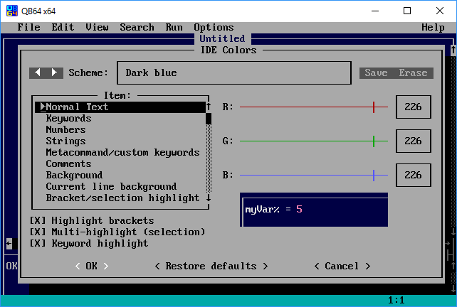
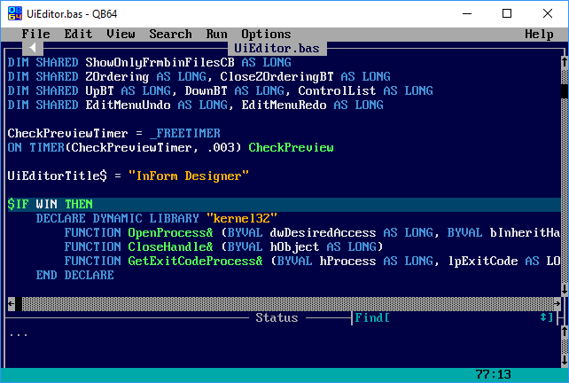

[Home](https://qb64.com) • [News](news.md) • [GitHub](https://github.com/QB64Official/qb64) • [Wiki](https://github.com/QB64Official/qb64/wiki) • [Samples](samples.md) • [Inform](inform.md) • [GX](gx.md) • [QBjs](qbjs.md) • [Community](community.md) • [More...](more.md)

## Get QB64

- [Download QB64](https://github.com/QB64Team/qb64/releases/tag/v2.0.2)
- [Development build(s)](dev.md) 
- [Source Code](github.md)

> A brief note regarding the current released version (v2.0.2, November 2021); it is still available via the now "disbanded" QB64Team repo; a new release is still the in the process awaiting for the dust to settle after the April 2022 "incident".  The 2.0.2 version is currently working except for the built in help system as that was being pulled from the now MIA qb64.org. 

> Work is taking place on restoring not only the project bits but on the overall structure/foundation of the QB64 project to protect against the incident around the negative actions of "RCCola" ever happening again - once these tasks are completed, a new release will be made; until then the latest official version of QB64 is v2.0.2.

**How BASIC made its way into the 21st century**

The BASIC language has been the gateway into programming for countless people. Popular as a beginner programming language in the 80’s and evolving into a powerful professional tool in 90’s, BASIC (and its successor QBasic), helped many people develop a love for programming. These languages provided the foundational learning platform for most of today’s professional developers.

The QB64 project has evolved over the last decade to bring the magic and educational potential of BASIC from its 20th century roots into the modern era. The QB64 project is already in use in both educational and professional contexts and has an active and helpful user community.

Unlike traditional BASIC and QBasic code, QB64 gets compiled automatically into machine code – allowing exceptional performance, easy distribution, and the ability to link with external C and C++ programming libaries. Compatible with most QBasic 4.5 code, QB64 adds a number of extensions, such as OpenGL and other modern features, providing the perfect blend of classic and modern program development.

QB64 is available for all recent Windows, Linux, and macOS versions.

## Who created QB64?

For some of the early history of QB64, check out [these interviews](galleon.md).

## Additional/Complementary Tools

There are several people in the community with projects that serve to compliment QB64; extending the reach and capability of the QB64 developer.

- [InForm](inform.md): Rapid Application Development (GUI) for QB64.
- [QBJS](qbjs.md): An implementation of the BASIC programming language for the web, with multimedia support and easy sharing of programs that aims compatibility with QBasic, QB4.5 and QB64.
- [QB64 Interpreter](https://github.com/FellippeHeitor/QB64-interpreter): Run QB64 commands on the fly or load a file and run it, no compilation required - written in QB64.
- [L-BASIC](https://github.com/flukiluke/L-BASIC): The L-BASIC compiler and interpreter implemented in QB64.  There is also this [forum thread](https://qb64forum.alephc.xyz/index.php?topic=2778.0) for some interesting background on the project.
- [Roslyn](https://github.com/dotnet/roslyn): Open-source MIT-licensed implementation of latest direct *"commercial"* decendant of QBasic/QB4.5 that targets the [.NET](https://dotnet.microsoft.com/) platform.

### What is InForm?

[InForm](inform.md) is a Rapid Application Development tool for QB64. It consists of a library of graphical routines and a WYSIWYG editor that allows you to design forms and export the resulting code to generate an event-driven QB64 program.

Want to build graphical UI applications across Windows, Linux and/or Mac? Check out [InForm](inform.md)!

### What is QBjs?

[QBJS](qbjs.md) can be considered a sort of *sister* project of QB64. It is heavily inspired by folks that have a huge appreciation for QB64 and the main developer that is working on this is "simply" continuing forward on a project that originally grew out of a pet project of his for QB64. This (previous) project, written in QB64, allows you to write your code in QB64 and then "convert" it to Javascript. The [QBJS](qbjs.md) project is taking this further by providing the necessary tools to write your code in the browser directly.

Interested in playing with QBasic/QB64 in the browser?  Check out [QBJS](qbjs.md).

### What is QB64 Interpreter?

Run QB64 commands on the fly or load a file and run it, no compilation required. Written in QB64!  Check it out at [QB64 Interpreter](https://github.com/FellippeHeitor/QB64-interpreter).

### What is L-BASIC?

[L-BASIC](https://github.com/flukiluke/L-BASIC) is a new BASIC language and compiler; a language variant that is reasonably close to QB64. However, it doesn't attempt to be 100% compatibile; willing to break compatibility with programs from 1985 when needed.  What makes this project interesting is that not only is it written in QB64, but it serves to explore ideas that "could be". This isn't to suggest that what [L-BASIC](https://github.com/flukiluke/L-BASIC) is doing will make it's way into QB64, but it does serve as an interesting thought experiment and visible example of what you could do if you desired to start with QB64 and "make it your own".  Check it out at [L-BASIC](https://github.com/flukiluke/L-BASIC).

### What is Roslyn?

Although a bit controversial to include this on this list, [Roslyn](https://github.com/dotnet/roslyn) notably includes self-hosting versions of the Visual Basic for [.NET](https://dotnet.microsoft.com/) compiler – a compiler written in the language itself. The compiler is available via the traditional command-line programs but also as APIs available natively from within [.NET](https://dotnet.microsoft.com/) code. [Roslyn](https://github.com/dotnet/roslyn) exposes modules for syntactic (lexical) analysis of code, semantic analysis, dynamic compilation to CIL, and code emission. This project was started in 2010, made open source in 2014 (Apache License 2.0) and released first version in Visual Studio 2015. At some point the license was transitioned to use the same license as [.NET](https://dotnet.microsoft.com/) (MIT-licensed). You can either work with this directly from command-line tools via [.NET](https://dotnet.microsoft.com/) or by installing the *Community Edition* (Free) of [Visual Studio](https://visualstudio.microsoft.com/). It is included in this list as a lot of the skills / foundation gained by working in QB64 can easily applied to VB and the scope of what can be done with [.NET](https://dotnet.microsoft.com/) is pretty impressive.

## FAQ

### What about the qb64.net website/domain?

Please make note that the .net domain for QB64 is highly suspect. Apparently the story goes that someone forgot to renew the domain name and it was snipped by a questionable party that subsequently mirrored the previous websites information and spammed it with dubious advertising. At this point it has nothing to do with QB64 and, ultimately, should be completely avoided given that the content could contain suspect binaries potentially containing malware. Additionally, it's been stated in the community has potentially having malware as part of the site - potentially infecting your machine by simply browsing to it. So, in the end, if you do venture there be sure to excercise caution.