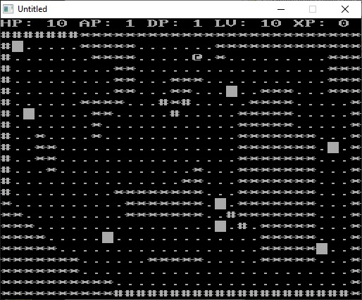

[Home](https://qb64.com) • [Forums](https://qb64.boards.net/) • [News](news.md) • [GitHub](https://github.com/QB64Official/qb64) • [Wiki](wiki.md) • [Samples](samples.md) • [InForm](inform.md) • [GX](gx.md) • [QBjs](qbjs.md) • [Community](community.md) • [More...](more.md)

## Games

### In-progress

The following games are still in development by their original author(s)/team(s).

**TerraQuest**

TerraQuest is a game in active development. • [GitHub](https://github.com/MaxineHelsel/CDF-Quest)

### Completed

Although nothing is truly ever *completed*, these are games that can be considered done enough to be very playable/enjoyable.

**Chess**

From member *ChiaPet*.  For Windows, Linux, and maybe Mac (last untested). Slices, dices, and makes Julienne fries!  No Ginsu knives. • [download](downloads/chess.7z)

---

**Moon Lander**

From member *ChiaPet*.  Objective is to land softly on level ground.  Cancel the horizontal velocity with left and right arrow, land by controlling the main thrust with up and down arrow. Has 10 surface features, including a McDonalds.  Several flying features, like a Death Star, Borg spacecraft, and black holes. Most of the files, in the directories stars1-3, are optional, only called upon if one turns on the stars with 1-4. Originally written in QB4.5.  Translated to QB64 it's much faster, which allows all features to be active at once - stuff like fancy ground, stars, a rotating Death Star, etc. Take a trip down memory lane with /, which changes the display to green screen, amber, or black & white. • [download](downloads/L64.7z)

---

**ROGLITE2.BAS**

"I've converted my ROGLITE game from Extended Color BASIC to QB64.  Didn't take much; most of the trouble came from changing my 1-based arrays to 0.  I guess I could have just used OPTION BASE 1.  Oh well." -- [Trey Tomes](https://github.com/treytomes) via Facebook • [download (original)](https://gist.github.com/treytomes/907e688642ade470df12b9188a01cf98?fbclid=IwAR04NSUHVsRqoFXmp8EnB8Sqgrgad3rUmEBqrmLLHotE3vfitus_nSZ-N6M) • [download (revised)](https://gist.github.com/treytomes/eb74540f16a31cedeba5bbb86de2b5b3?fbclid=IwAR0J5ZPAQk8HtWqQgaalf-EZCfziBYwxu0ZzpvUk8y3hKsaNq18T2HDZyLA)

### Proof-of-Concepts

The following games are designed as visible examples demonstrating techniques, ideas and/or engines/frameworks.

**Sleighless**

Oh no! Santa has fallen out of the sleigh!  Rudolph is gone and now Santa must save Christmas alone and... Sleighless!  This is a [demonstration](https://boxgm.itch.io/sleighless) of the GX game engine's ability to export games built in QB64 to the web.  • [download](downloads/santa.zip) • [more...](https://qb64forum.alephc.xyz/index.php?topic=4454.msg139230#msg139230)

---

**Zelda - The Legend of GX**

Since there are a number of zelda projects currently in-progress, I thought I'd put together a little version as a shameless plug for GX.  One of my current game projects is actually a NES mashup that will have crossover from a number of titles.  So I already had the map built using the GX map editor.  This version will let you walk the entire overworld map.  As an example I've also implemented the lost woods maze.  There are triggers on the map for all of the cave and dungeon entrances.  At the moment this will take you to an empty cave map.  (I haven't built any dungeon maps.)  If you exit the cave it reloads the overworld map and puts you back in the right spot. • [download](downloads/legend-of-gx.zip) • [more...](https://qb64forum.alephc.xyz/index.php?topic=4528.0)

### Game Engine

The following entries are designed (hopefully) to make it easier for a QB64 game developer to get started actually building what they imagine without having to start at completely ground zero.

**GX Game Engine**

GX is a basic game engine... literally. This is a Game(G) Engine(X) built with and for QB64. GX supports basic 2D gaming: platformer, top-down, etc.... you know, classic NES/SNES type games. • [GitHub](https://github.com/boxgaming/gx)

### Incomplete/Abandoned?

*coming soon*

### Resources

- [OpenGameArt.org](https://opengameart.org)

> Written a game in QB64? Get it added to this list! Please provide a screen shot, summary, download url, github url, discussion/forum url, etc.

### Additional

- [Jam for All BASIC Dialects #1 (2021)](https://itch.io/jam/jam-for-all-basic-dialects)
- [Jam for All BASIC Dialects #2 (2022)](https://itch.io/jam/jam-for-all-basic-dialects-2)
- [Jam for All BASIC Dialects #3 (2022)](https://itch.io/jam/jam-for-all-basic-dialects-3)
