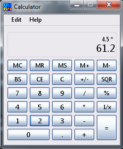

[Home](https://qb64.com) • [News](news.md) • [GitHub](github.md) • [Wiki](wiki.md) • [Games](games.md) • [Media](media.md) • [Community](community.md) • [Rolodex](rolodex.md) • [More...](more.md)

A GUI engine and WYSIWYG interface designer for QB64.

## The ultimate GUI toolkit for QB64

InForm is a Rapid Application Development tool for QB64. It consists of a library of graphical routines and a WYSIWYG editor that allows you to design forms and export the resulting code to generate an event-driven QB64 program.

### Download

Please visit the [GitHub repo](https://github.com/FellippeHeitor).

### Wiki

You can find the InForm wiki on [Fellippe Heitor's GitHub repo](https://github.com/FellippeHeitor/InForm/wiki).

### Videos

There are several great videos that Fellippe created that are online:

- [Overview](https://www.youtube.com/watch?v=OTEtftKlgsA)
- [Workflow](https://www.youtube.com/watch?v=wqKBKr9h1Kw)
- [Writing a small project](https://www.youtube.com/watch?v=437GhtLsND4)
- [Tutorial - Creating a Simple App with InForm (Tic Tac Toe)](https://www.youtube.com/watch?v=a9pNGBaIr94)
- [How to create a label that spans multiple lines](https://youtu.be/NSCfVRTPvso)

### Samples

[InForm Calculator by Terry Ritchie](downloads/calculator.zip)

### Forum

[QB64.org Forum - InForm (read-only)](https://qb64forum.alephc.xyz/index.php?board=11.0)

### Contact

Please utilize the [GitHub repo](https://github.com/FellippeHeitor).