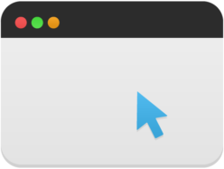
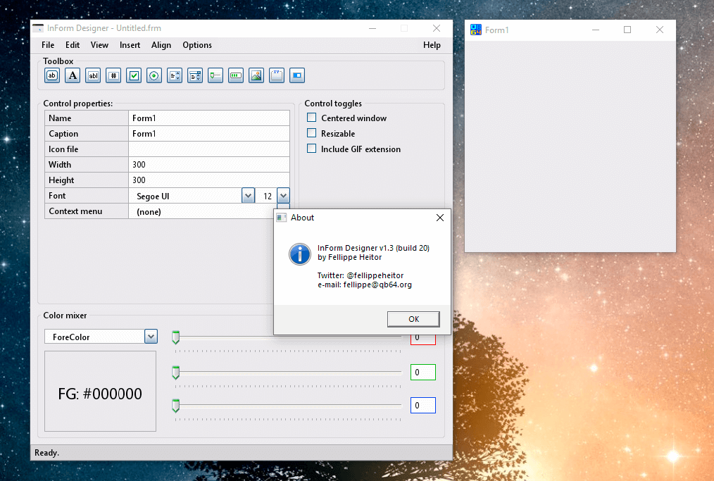
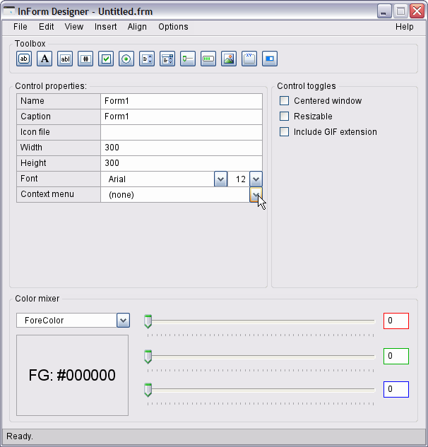
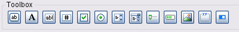
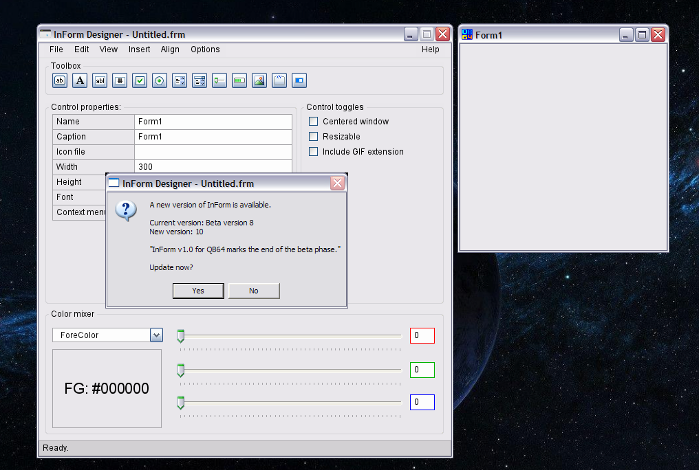
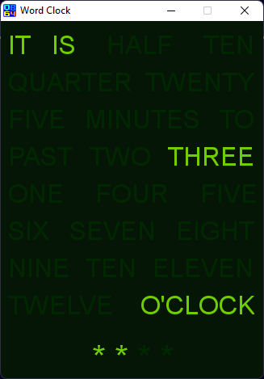
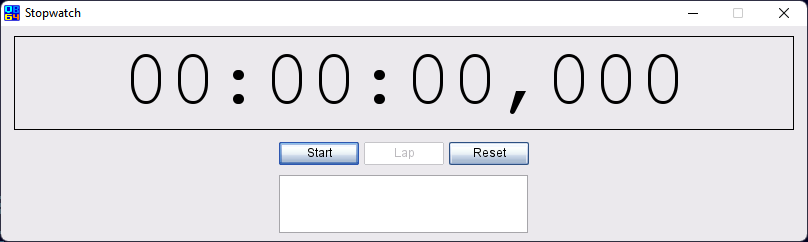
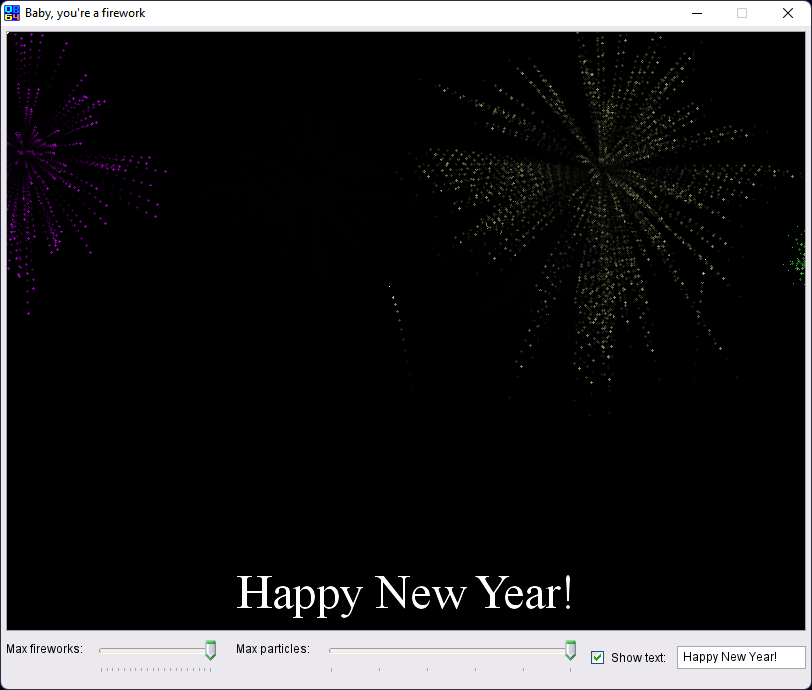

[Home](https://qb64.com) • [Forums](https://qb64.boards.net/) • [News](news.md) • [GitHub](https://github.com/QB64Official/qb64) • [Wiki](wiki.md) • [Samples](samples.md) • [InForm](inform.md) • [GX](gx.md) • [QBjs](qbjs.md) • [Community](community.md) • [More...](more.md)

A GUI engine and WYSIWYG interface designer for QB64.

## The ultimate GUI toolkit for QB64

InForm is a Rapid Application Development tool for QB64. It consists of a library of graphical routines and a WYSIWYG editor that allows you to design forms and export the resulting code to generate an event-driven QB64 program.

### Overview

<iframe width="560" height="315" src="https://www.youtube.com/embed/9UAzHco-Fgs" title="YouTube video player" frameborder="0" allow="accelerometer; autoplay; clipboard-write; encrypted-media; gyroscope; picture-in-picture" allowfullscreen></iframe>

**Event-driven QB64 programs**

Inform's main goal is to generate event-driven QB64 applications. This means that you design a graphical user interface with interactive controls and then write the code to respond to such controls once they are manipulated.

#### Workflow

After your form looks the way you want it to, click File -> Save to export its contents and generate a .bas source file. Two files are output:

* **.frm** the generated form in QB64 code. This can be loaded back into the form designer or edited in QB64 or any text editor later, if you want to adjust fine details.
* **.bas** the actual program you will add your code to.
You add code to respond to events:
  * *Click*
  * *MouseEnter/MouseLeave* (hover)
  * *FocusIn/FocusOut*
  * *MouseDown/MouseUp* (events preceding a *Click*)
  * *KeyPress*
  * *TextChanged* (for text box controls)
  * *ValueChanged* (for track bars, lists and dropdown lists)
* There are also events that occur in specific moments, to which you can respond/add code:
  * *BeforeInit*, triggered just before the form is shown.
  * *OnLoad*, triggered right after the form is first shown.
  * *BeforeUpdateDisplay*, triggered everytime the form is about to be repainted.
  * *BeforeUnload*, triggered when the user tries to close the program, either via clicking the window’s X button, right click in the task bar -> Close or with Alt+F4 (Windows only).
  * *FormResized*, triggered when a form with the CanResize property is resized at runtime.

### Editor

You create a new form with the Editor. You can add new controls, edit their properties, align controls and edit their z-ordering.

The following controls are available (as of v1.0).

- Button
- Label
- Textbox
- Numeric Textbox
- Checkbox
- Radio button
- List
- Dropdown list
- Track bar/Slider
- Progress bar
- Picture box
- Frame
- Toggle switch
- Menus

You can also add menus (both in the menu bar or as contextual menus) to your program (Insert - Add menu bar/context menu).

## Preview Component

Your form's design is updated in real-time. The preview component is automatically launched with the Editor and gives you several tools to format your controls.

Features:

* Drag and resize multiple controls at once
* Right-click contextual menu allows:
  * Add menus
  * Aligning selected controls​
  * Center individual controls or groups of selected controls
  * Clipboard operations
* Keyboard​-enabled: the most common keyboard shortcuts will respond as you expect them to.

### Download

Please visit the [Inform GitHub repo - releases](https://github.com/FellippeHeitor/InForm/releases).

### Documentation

You can find the InForm wiki on [Fellippe Heitor's GitHub repo](https://github.com/FellippeHeitor/InForm/wiki).

### Videos

There are several great videos that Fellippe created that are online:

- [Overview](https://www.youtube.com/watch?v=OTEtftKlgsA)
- [Workflow](https://www.youtube.com/watch?v=wqKBKr9h1Kw)
- [Writing a small project](https://www.youtube.com/watch?v=437GhtLsND4)
- [Tutorial - Creating a Simple App with InForm (Tic Tac Toe)](https://www.youtube.com/watch?v=a9pNGBaIr94)
- [How to create a label that spans multiple lines](https://youtu.be/NSCfVRTPvso)

### Samples

[Word Clock](https://github.com/FellippeHeitor/InForm-demos/tree/master/WordClock)

[Stopwatch](https://github.com/FellippeHeitor/InForm-demos/tree/master/Stopwatch)

[Simple Tic Tac Toe Game](https://github.com/FellippeHeitor/InForm-demos/tree/master/InformTicTacToe)

<iframe width="560" height="315" src="https://www.youtube.com/embed/L9FmJBN4_SQ" title="YouTube video player" frameborder="0" allow="accelerometer; autoplay; clipboard-write; encrypted-media; gyroscope; picture-in-picture" allowfullscreen></iframe>

[Improved Tic Tac Toe Game](https://github.com/FellippeHeitor/InForm-demos/tree/master/InformTicTacToe2)

<iframe width="560" height="315" src="https://www.youtube.com/embed/8_D5YQj6XI4" title="YouTube video player" frameborder="0" allow="accelerometer; autoplay; clipboard-write; encrypted-media; gyroscope; picture-in-picture" allowfullscreen></iframe>

[Fireworks Simulation with Visual Controls](https://github.com/FellippeHeitor/InForm-demos/tree/master/Fireworks2Inform)

[InForm Calculator by Terry Ritchie](downloads/calculator.zip)

### Blog

[via Archive.org](https://web.archive.org/web/20210508105104/https://www.qb64.org/inform/blog/)

### Forum

[QB64.org Forum - InForm (read-only)](https://qb64forum.alephc.xyz/index.php?board=11.0)

### Contact

Please utilize the [GitHub repo](https://github.com/FellippeHeitor).

*The InForm source code is licensed under the MIT License and is also available on GitHub and you can follow development as it goes.*