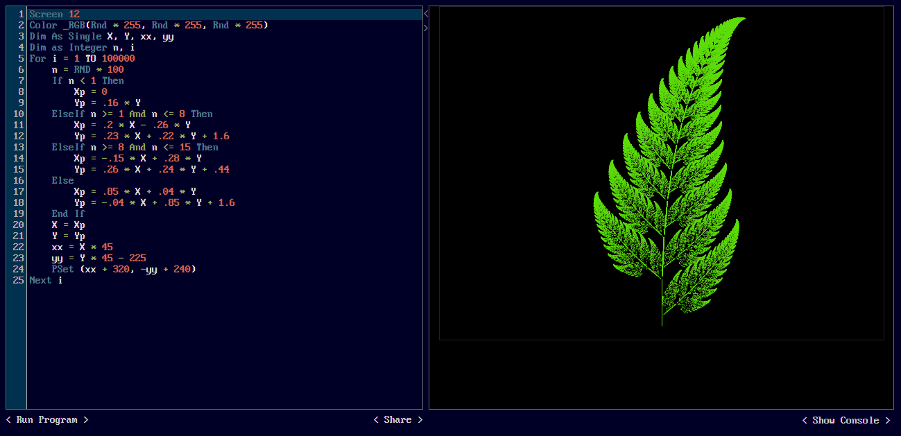

[Home](https://qb64.com) • [News](news.md) • [GitHub](github.md) • [Wiki](wiki.md) • [Games](games.md) • [Media](media.md) • [Community](community.md) • [Rolodex](rolodex.md) • [More...](more.md)

## QBJS

The QBasic you love, now on the web.

[QBJS](http://qbjs.org) is an implementation of the Basic programming language for the web, with multimedia support and easy sharing of programs. It aims to be compatible with [QB64](htts://qb64.com), which in turn implements the same dialect as the classic QBasic.

The project is in active development as of 30 March 2022. It can be tried [online](https://qbjs.org); documentation and releases are hosted on [GitHub](https://github.com/boxgaming/qbjs).

Support for browser APIs is built-in as of version 0.4.0-beta; a game engine is included separately.

- [QBJS Sandbox](https://boxgm.itch.io/qbjs)
- [QBJS GitHub](https://github.com/boxgaming/qbjs)
- [QBJS Wiki](https://github.com/boxgaming/qbjs/wiki)
- [QBJS Sandbox (dev)](boxgm.itch.io/qbjs-dev)
