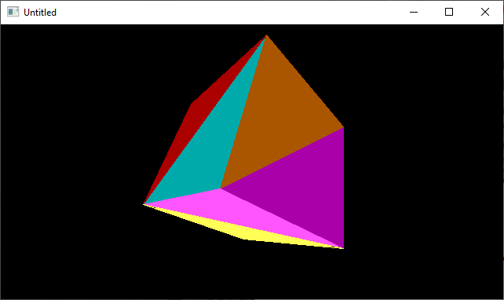

[Home](https://qb64.com) • [News](../../news.md) • [GitHub](https://github.com/QB64Official/qb64) • [Wiki](https://github.com/QB64Official/qb64/wiki) • [Samples](../../samples.md) • [InForm](../../inform.md) • [GX](../../gx.md) • [QBjs](../../qbjs.md) • [Community](../../community.md) • [More...](../../more.md)

## SAMPLE: 3D CUBE



### Author

[🐝 Relsoft](../relsoft.md) 

### Description

```text
3d cube
polygon filled using paint. ;*)
I could probably shorten the code in less than 20 lines but
I'd rather make another 25 liner. ;*)
Relsoft 2003
```

### QBjs

> Please note that QBjs is still in early development and support for these examples is extremely experimental (meaning will most likely not work). With that out of the way, give it a try!

* [LOAD "3dcube25.bas"](https://qbjs.org/index.html?src=https://qb64.com/samples/3d-cube/src/3dcube25.bas)
* [RUN "3dcube25.bas"](https://qbjs.org/index.html?mode=auto&src=https://qb64.com/samples/3d-cube/src/3dcube25.bas)
* [PLAY "3dcube25.bas"](https://qbjs.org/index.html?mode=play&src=https://qb64.com/samples/3d-cube/src/3dcube25.bas)

### File(s)

* [3dcube25.bas](src/3dcube25.bas)

🔗 [3d](../3d.md), [cube](../cube.md)
