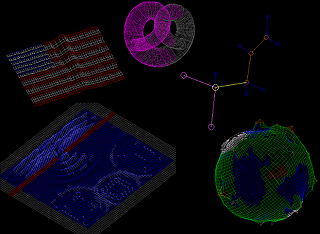
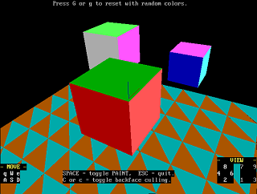

[Home](https://qb64.com) • [News](../../news.md) • [GitHub](https://github.com/QB64Official/qb64) • [Wiki](https://github.com/QB64Official/qb64/wiki) • [Samples](../../samples.md) • [InForm](../../inform.md) • [GX](../../gx.md) • [QBjs](../../qbjs.md) • [Community](../../community.md) • [More...](../../more.md)

## SAMPLE: 3D ENGINE PROTOTYPES



### Author

[🐝 STxAxTIC](../stxaxtic.md) 

### Description

```text
Various experiments in software 3D graphics. Warning: Uses no functions or subs!
```

### QBjs

> Please note that QBjs is still in early development and support for these examples is extremely experimental (meaning will most likely not work). With that out of the way, give it a try!

* [LOAD "3dctrwgraph_fb64.bas"](https://qbjs.org/index.html?src=https://qb64.com/samples/3d-engine-prototypes/src/3dctrwgraph_fb64.bas)
* [RUN "3dctrwgraph_fb64.bas"](https://qbjs.org/index.html?mode=auto&src=https://qb64.com/samples/3d-engine-prototypes/src/3dctrwgraph_fb64.bas)
* [PLAY "3dctrwgraph_fb64.bas"](https://qbjs.org/index.html?mode=play&src=https://qb64.com/samples/3d-engine-prototypes/src/3dctrwgraph_fb64.bas)

### File(s)

* [3dctrwgraph_fb64.bas](src/3dctrwgraph_fb64.bas)
* [3dctrwgraph_fb64.zip](src/3dctrwgraph_fb64.zip)

### Additional Image(s)



🔗 [3d](../3d.md), [graph](../graph.md)
