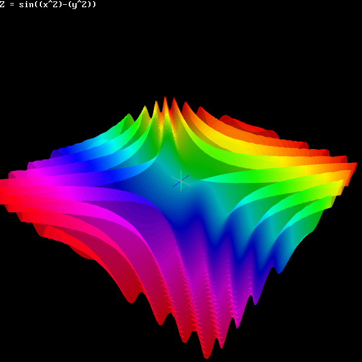

[Home](https://qb64.com) • [News](../../news.md) • [GitHub](https://github.com/QB64Official/qb64) • [Wiki](https://github.com/QB64Official/qb64/wiki) • [Samples](../../samples.md) • [InForm](../../inform.md) • [GX](../../gx.md) • [QBjs](../../qbjs.md) • [Community](../../community.md) • [More...](../../more.md)

## SAMPLE: 3D GRAPHER



### Authors

[🐝 Ashish Kushwaha](../ashish-kushwaha.md) [🐝 STxAxTIC](../stxaxtic.md) 

### Description

```text
3D Grapher made in QB64.
```

### File(s)

* [3d-grapher---legacy.bas](src/3d-grapher---legacy.bas)
* [3d-grapher---parametric.bas](src/3d-grapher---parametric.bas)
* [3d-grapher.zip](src/3d-grapher.zip)

🔗 [3d](../3d.md), [gl](../gl.md)


<sub>Reference: [github.com](https://github.com/AshishKingdom/3D-Grapher) </sub>
