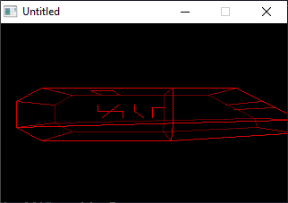

[Home](https://qb64.com) • [News](../../news.md) • [GitHub](https://github.com/QB64Official/qb64) • [Wiki](https://github.com/QB64Official/qb64/wiki) • [Samples](../../samples.md) • [InForm](../../inform.md) • [GX](../../gx.md) • [QBjs](../../qbjs.md) • [Community](../../community.md) • [More...](../../more.md)

## SAMPLE: 3D WIREFRAME



### Author

[🐝 Rich Geldreich](../rich-geldreich.md) 

### Description

```text
'3DEXP2.BAS By Rich Geldreich June 2nd, 1992
'A fast, QuickBASIC 4.5 3-D wireframe animation program.
'Compile it for maximum speed!
'If you have any questions or ideas, please write/call:

'Rich Geldreich
'410 Market St.
'Gloucester City, NJ 08030
'(609)-742-8752

'The following program is in the public domain! Have fun!
'Also look at VECT.ASM
```

### QBjs

> Please note that QBjs is still in early development and support for these examples is extremely experimental (meaning will most likely not work). With that out of the way, give it a try!

* [LOAD "3dexp2.bas"](https://qbjs.org/index.html?src=https://qb64.com/samples/3d-wireframe/src/3dexp2.bas)
* [RUN "3dexp2.bas"](https://qbjs.org/index.html?mode=auto&src=https://qb64.com/samples/3d-wireframe/src/3dexp2.bas)
* [PLAY "3dexp2.bas"](https://qbjs.org/index.html?mode=play&src=https://qb64.com/samples/3d-wireframe/src/3dexp2.bas)

### File(s)

* [3dexp2.bas](src/3dexp2.bas)

🔗 [3d](../3d.md), [wireframe](../wireframe.md), [legacy](../legacy.md)
