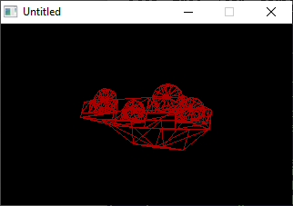

[Home](https://qb64.com) • [News](../../news.md) • [GitHub](../../github.md) • [Wiki](../../wiki.md) • [Samples](../../samples.md) • [Media](../../media.md) • [Community](../../community.md) • [Rolodex](../../rolodex.md) • [More...](../../more.md)

## SAMPLE: 3DS VIEWER



### Description

```text
3D Grapher made in QB64.
```

### File(s)

* [3dsviewer.bas](src/3dsviewer.bas)
* [3dsviewer.zip](src/3dsviewer.zip)
* [car.3ds](src/car.3ds)

🔗 [3d](../3d.md), [wireframe](../wireframe.md), [legacy](../legacy.md)
