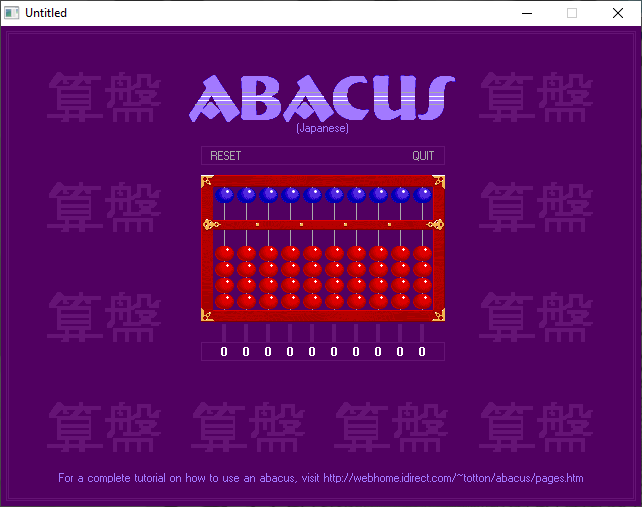

[Home](https://qb64.com) • [News](../../news.md) • [GitHub](../../github.md) • [Wiki](../../wiki.md) • [Samples](../../samples.md) • [Media](../../media.md) • [Community](../../community.md) • [Rolodex](../../rolodex.md) • [More...](../../more.md)

## SAMPLE: ABACUS

### Author

[🐝 Bob Seguin](../bob-seguin.md) 

### Description

Abacus app by Bob Seguin.

NOTE: This game requires graphics files created by any accompanying .bas programs in the zip file. If two or more accompanying .bas files are present, run the first on only. It will automatically chain (run) the second file. After you run the accompanying .bas file, the main program ready to use!

### File(s)

* [a12gfx.bas](src/a12gfx.bas)
* [abacus.zip](src/abacus.zip)
* [abacus1.bsv](src/abacus1.bsv)
* [abacus12.bas](src/abacus12.bas)
* [abacus2.bsv](src/abacus2.bsv)
* [abacus3.bsv](src/abacus3.bsv)
* [abamenu.bsv](src/abamenu.bsv)
* [abanums.bsv](src/abanums.bsv)
* [abasets.bsv](src/abasets.bsv)
* [readme.txt](src/readme.txt)

🔗 [abacus](../abacus.md), [arithmetic](../arithmetic.md)
