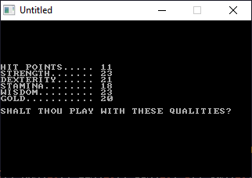

[Home](https://qb64.com) • [News](../../news.md) • [GitHub](../../github.md) • [Wiki](../../wiki.md) • [Samples](../../samples.md) • [Media](../../media.md) • [Community](../../community.md) • [Rolodex](../../rolodex.md) • [More...](../../more.md)

## SAMPLE: ALEKBETH



### Author

[🐝 Richard C Garriott](../richard-c-garriott.md) 

### Description

```text
Description:	"Akalabeth: World of Doom" is the predecessor of the Ultima series of role playing games
Modifications:	i. CLEAR statement commented
                ii. "END"s instead of restarting to avoid problems associated with (i)
```

### QBjs

> Please note that QBjs is still in early development and support for these examples is extremely experimental (meaning will most likely not work). With that out of the way, give it a try!

* [LOAD "aklabeth.bas"](https://v6p9d9t4.ssl.hwcdn.net/html/5963335/index.html?src=https://qb64.com/samples/alekbeth/src/aklabeth.bas)
* [RUN "aklabeth.bas"](https://v6p9d9t4.ssl.hwcdn.net/html/5963335/index.html?mode=auto&src=https://qb64.com/samples/alekbeth/src/aklabeth.bas)
* [PLAY "aklabeth.bas"](https://v6p9d9t4.ssl.hwcdn.net/html/5963335/index.html?mode=play&src=https://qb64.com/samples/alekbeth/src/aklabeth.bas)

### File(s)

* [aklabeth.bas](src/aklabeth.bas)

🔗 [game](../game.md), [legacy](../legacy.md)
