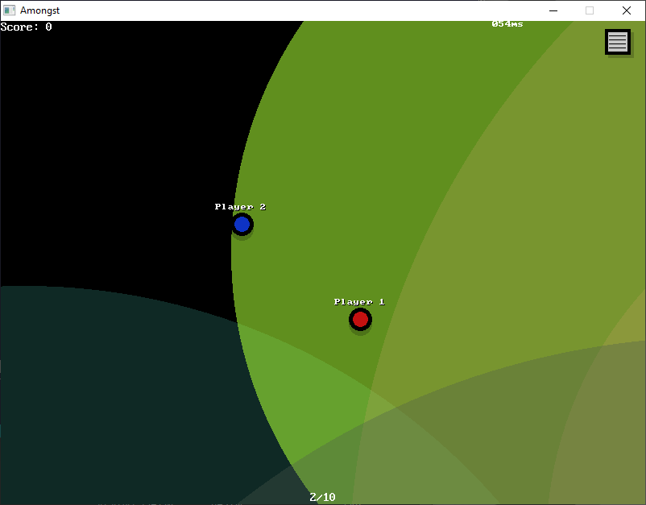

[Home](https://qb64.com) • [News](../../news.md) • [GitHub](https://github.com/QB64Official/qb64) • [Wiki](https://github.com/QB64Official/qb64/wiki) • [Samples](../../samples.md) • [InForm](../../inform.md) • [GX](../../gx.md) • [QBjs](../../qbjs.md) • [Community](../../community.md) • [More...](../../more.md)

## SAMPLE: AMONGST



### Author

[🐝 Fellippe Heitor](../fellippe-heitor.md) 

### Description

```text
A pretentious clone attempt of Among Us (originally by Inner Sloth)

To test:
1) Compile/run amongst_server.bas. 
2) Compile/run amongst.bas, choose name and color, join local host.
3) Compile/run amongst.bas a second time, choosing another name and color, join same local host.
```

### File(s)

* [amongst.bas](src/amongst.bas)
* [amongst.zip](src/amongst.zip)
* [amongst_server.bas](src/amongst_server.bas)
* [amongst_updater.bas](src/amongst_updater.bas)

🔗 [game](../game.md), [multiplayer](../multiplayer.md)


<sub>Reference: [github.com](https://github.com/FellippeHeitor/amongst) </sub>
