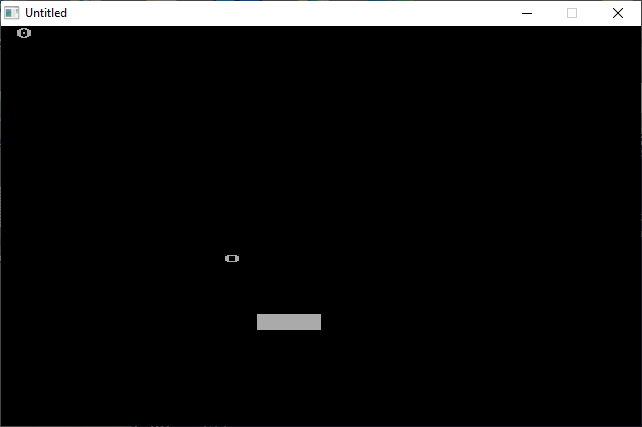

[Home](https://qb64.com) • [News](../../news.md) • [GitHub](https://github.com/QB64Official/qb64) • [Wiki](https://github.com/QB64Official/qb64/wiki) • [Samples](../../samples.md) • [InForm](../../inform.md) • [GX](../../gx.md) • [QBjs](../../qbjs.md) • [Community](../../community.md) • [More...](../../more.md)

## SAMPLE: ASCIIPONG



### Author

[🐝 qbguy](../qbguy.md) 

### Description

```text
' This work has been released into the public domain by the copyright
' holder. This applies worldwide.
'
' In case this is not legally possible:
' The copyright holder grants any entity the right to use this work for any
' purpose, without any conditions, unless such conditions are required by
' law.
```

### QBjs

> Please note that QBjs is still in early development and support for these examples is extremely experimental (meaning will most likely not work). With that out of the way, give it a try!

* [LOAD "ascipong.bas"](https://qbjs.org/index.html?src=https://qb64.com/samples/asciipong/src/ascipong.bas)
* [RUN "ascipong.bas"](https://qbjs.org/index.html?mode=auto&src=https://qb64.com/samples/asciipong/src/ascipong.bas)
* [PLAY "ascipong.bas"](https://qbjs.org/index.html?mode=play&src=https://qb64.com/samples/asciipong/src/ascipong.bas)

### File(s)

* [ascipong.bas](src/ascipong.bas)

🔗 [game](../game.md), [pong](../pong.md), [legacy](../legacy.md)
