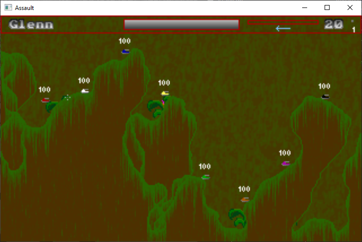

[Home](https://qb64.com) • [News](../../news.md) • [GitHub](../../github.md) • [Wiki](../../wiki.md) • [Samples](../../samples.md) • [Media](../../media.md) • [Community](../../community.md) • [Rolodex](../../rolodex.md) • [More...](../../more.md)

## SAMPLE: ASSAULT

### Author

[🐝 Glenn Powell](../glenn-powell.md) 

### Description

This is a game of weapons and destruction that relies upon the properties of physics as well as your skill. There can be up to 4 players on up to 4 teams playing at one time.  Each player controls a tank that is equiped with various weapons.  You can set the amount of ammo for each of these devices in the Configuration.  You can also use the Configuration to set the amount of health you start with, player names, teams, control keys, and other options...

### File(s)

* [assault.bas](src/assault.bas)
* [assault.zip](src/assault.zip)

🔗 [game](../game.md)
