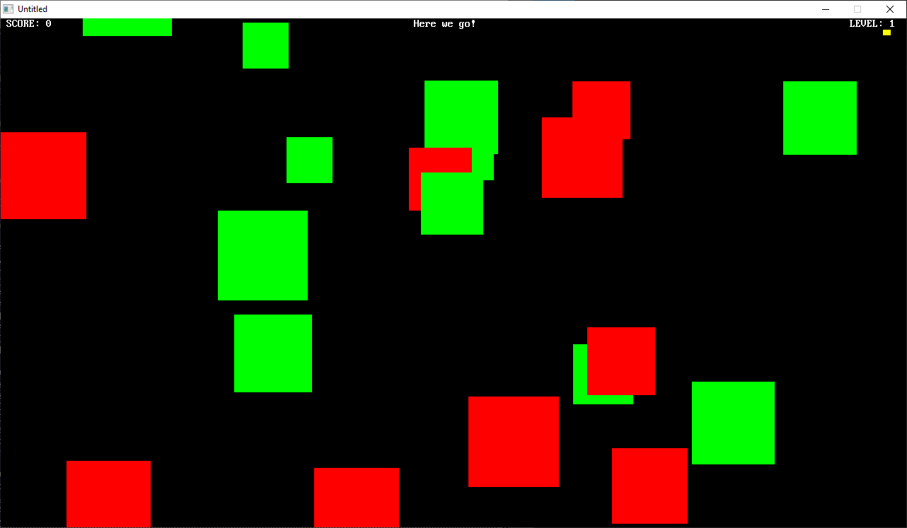

[Home](https://qb64.com) • [News](../../news.md) • [GitHub](../../github.md) • [Wiki](../../wiki.md) • [Samples](../../samples.md) • [Media](../../media.md) • [Community](../../community.md) • [Rolodex](../../rolodex.md) • [More...](../../more.md)

## SAMPLE: BAD BOXES



### Author

[🐝 Terry Ritchie](../terry-ritchie.md) 

### Description

```text
'**
'** Program Name: Bad Boxes
'** Version     : 1.0
'** Author      : Terry Ritchie
'** Date        : January 23rd, 2013
'** Description : Use your yellow box to capture the green (good) boxes for points while avoiding the red (bad) boxes.
'**
'** Controls    : Use the mouse to move the yellow box around the screen.
'**
'** Notes       : Good luck! The game gets progrssively harder.
'**
```

### File(s)

* [badbox.bas](src/badbox.bas)
* [badbox.zip](src/badbox.zip)

🔗 [game](../game.md), [bad boxes](../bad-boxes.md)
