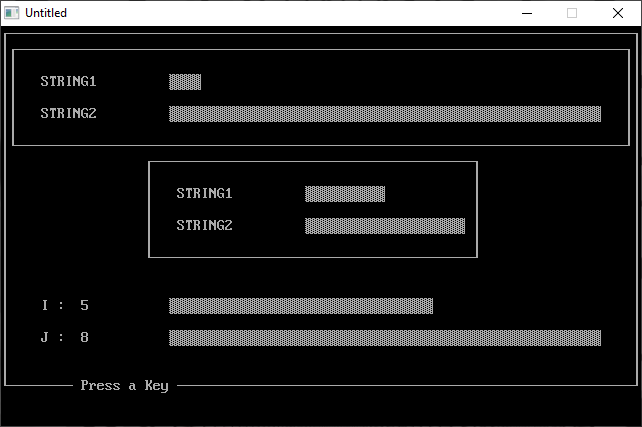

[Home](https://qb64.com) • [News](../../news.md) • [GitHub](https://github.com/QB64Official/qb64) • [Wiki](https://github.com/QB64Official/qb64/wiki) • [Samples](../../samples.md) • [InForm](../../inform.md) • [GX](../../gx.md) • [QBjs](../../qbjs.md) • [Community](../../community.md) • [More...](../../more.md)

## SAMPLE: BAR DEMO



### Author

[🐝 Douglas Park](../douglas-park.md) 

### Description

```text
' BARDEMO.BAS
' by Douglas Park
' Copyright (C) 1995 DOS World Magazine
' Published in Issue #19, January 1995, page 60

***************************************************************************** 
 BARDEMO.BAS 
   by Douglas Park 
 Copyright (C) 1995 DOS World Magazine 
 Published in Issue #19, January 1995, page 60 
 
If you often find graphs easier to understand than numbers, the CHART  
subroutine in this program will allow you to compare two numbers visually in  
the form of bar graphs.  BARDEMO.BAS is a demonstration program that  
illustrates the usage of CHART.  As a bonus, the program also includes the  
BOX subroutine, which makes it easy to draw boxes on the display. 
 
To run the program from the DOS command line, change to the directory  
containing BARDEMO.BAS, then type: 
 
QBASIC /RUN BARDEMO 
 
 
When you run BARDEMO.BAS, it first displays two graphs, each of which  
visually compares two numbers.  One graph occupies the full width of the  
display, and a smaller one is centered in the middle of the display.  A third  
graph appears at the bottom of the display when you press a key in response  
to the on-screen prompt.  The lengths of the bars in this graph change each  
time you press a key. 
 
The CHART subroutine uses one of DOS’s shaded box characters to create its  
bar graph, automatically adjusting the length of the bar representing the  
largest quantity so it will fit on a standard 80-column display.  The length  
of the bar representing the smaller of the two quantities is automatically  
adjusted in proportion to the larger bar.  CHART limits the length of the  
longest bar to 56 characters. 
 
Calls to CHART are in the following form: 
 
CALL CHART (STR1$, STR2$, NUM1%, NUM2%, WID%, X%, Y%) 
 
Thus, CHART requires that your program specify seven values: 
 
STR1$ and STR2$ are the labels for the two bars. 
NUM1% and NUM2% are the two numbers (integers) you wish to compare.  The 
     largest integer allowed by QBasic is 32767. 
WID% is the maximum width of the longer of the two bars.  If you specify a 
     value larger than 56, CHART reduces it to 56. 
X% and Y% are the row and column on the screen where the graph will be 
     displayed. 
 
The BOX subroutine draws a single-line border of any size you specify.  Calls  
to BOX are in the following form: 
 
CALL BOX (Y1%, X1%, Y2%, X2%) 
 
The first two values, Y1% and X1%, are the row and column on the screen of  
the upper-left corner of the box.  The third and fourth values, Y2% and X2%,  
are the row and column of the lower right corner of the box. 
 
These two subroutines can be incorporated into your own programs.  Use CHART  
when you want a visual representation of the relative sizes of two numbers.   
Use BOX as a quick and easy way to draw boxes around portions of the screen  
display.
```

### QBjs

> Please note that QBjs is still in early development and support for these examples is extremely experimental (meaning will most likely not work). With that out of the way, give it a try!

* [LOAD "bardemo.bas"](https://qbjs.org/index.html?src=https://qb64.com/samples/bar-demo/src/bardemo.bas)
* [RUN "bardemo.bas"](https://qbjs.org/index.html?mode=auto&src=https://qb64.com/samples/bar-demo/src/bardemo.bas)
* [PLAY "bardemo.bas"](https://qbjs.org/index.html?mode=play&src=https://qb64.com/samples/bar-demo/src/bardemo.bas)

### File(s)

* [bardemo.bas](src/bardemo.bas)

🔗 [tui](../tui.md), [dos world](../dos-world.md)
