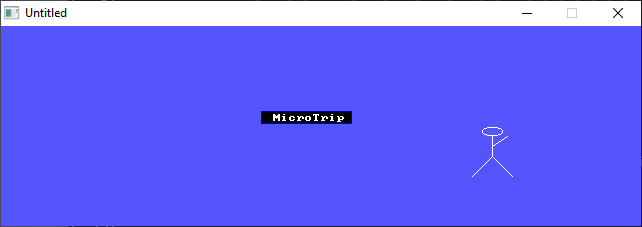

[Home](https://qb64.com) • [News](../../news.md) • [GitHub](https://github.com/QB64Official/qb64) • [Wiki](https://github.com/QB64Official/qb64/wiki) • [Samples](../../samples.md) • [InForm](../../inform.md) • [GX](../../gx.md) • [QBjs](../../qbjs.md) • [Community](../../community.md) • [More...](../../more.md)

## SAMPLE: BEATDOWN



### Author

[🐝 Brian Murphy](../brian-murphy.md) 

### Description

```text
'                                   Beat Down
'                                1998 MicroTrip
'                        V1.1 Origanally availible on
'                                   12-14-98
'
'                              Visit our Web Site At
'                                      At
'       http://www.geocities.com/SiliconValley/Platform/8409/qbasic.html
'                    E-Mail me at       microtrip@geocities.com
'                            ***Hit `F5' to play!!***
```

### QBjs

> Please note that QBjs is still in early development and support for these examples is extremely experimental (meaning will most likely not work). With that out of the way, give it a try!

* [LOAD "beatdown.bas"](https://qbjs.org/index.html?src=https://qb64.com/samples/beatdown/src/beatdown.bas)
* [RUN "beatdown.bas"](https://qbjs.org/index.html?mode=auto&src=https://qb64.com/samples/beatdown/src/beatdown.bas)
* [PLAY "beatdown.bas"](https://qbjs.org/index.html?mode=play&src=https://qb64.com/samples/beatdown/src/beatdown.bas)

### File(s)

* [beatdown.bas](src/beatdown.bas)
* [beatdown.zip](src/beatdown.zip)

🔗 [game](../game.md), [legacy](../legacy.md)
