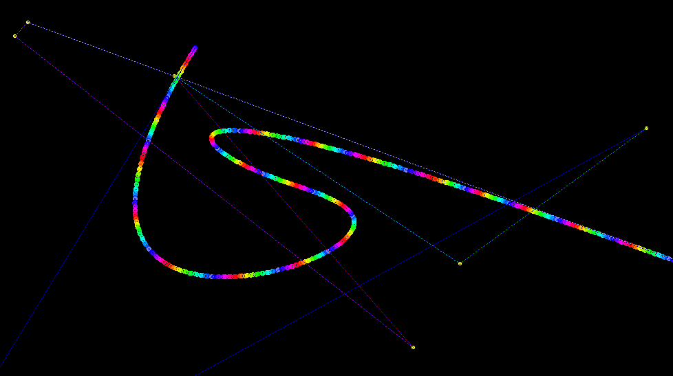

[Home](https://qb64.com) • [News](../../news.md) • [GitHub](../../github.md) • [Wiki](../../wiki.md) • [Samples](../../samples.md) • [Media](../../media.md) • [Community](../../community.md) • [Rolodex](../../rolodex.md) • [More...](../../more.md)

## SAMPLE: BEZIER



### Author

[🐝 Rho Sigma](../rho-sigma.md) 

### Description

```text
'+---------------+---------------------------------------------------+
'|_######_######_|_____.--._._________.-.____________________________|
'|_##__##_##___#_|_____|___)|________(___)_o_________________________|
'|_##__##__##____|_____|--'_|--._.-.__`-.__.__.-...--.--._.-.________|
'|_######___##___|_____|__\_|__|(___)(___)_|_(___||__|__|(___)_______|
'|_##______##____|_____'___`'__`-`-'__`-'-'_`-`-`|'__'__`-`-'`-______|
'|_##_____##___#_|____________________________._.'___________________|
'|_##_____######_|__Sources_&_Documents_placed_in_the_Public_Domain._|
'+---------------+---------------------------------------------------+
'|                                                                   |
'| === ScreenBlankers-Info.html ===                                  |
'|                                                                   |
'| == Some simple screen blankers I wrote using QB64.                |
'|                                                                   |
'+-------------------------------------------------------------------+
'| Done by RhoSigma, R.Heyder, provided AS IS, use at your own risk. |
'| Find me in the QB64 Forum or mail to support@rhosigma-cw.net for  |
'| any questions or suggestions. Thanx for your interest in my work. |
'+-------------------------------------------------------------------+
Screen Blankers
This is a small collection of some simple screen blanker modules. Most of them are written by myself, others were just graphic sample programs from other QB64 Forum members, which I've altered into a blanker module. Just read the header notes in each module for more information.

To install one of it (on a Windows system), simply rename the created .exe file with the new extension .scr, confirm the possible warning about changing the file extension with Yes. After that you can simply right click on the renamed file and choose Install.

Sorry, I've no idea how to do it on MacOS or Linux, any info about it from people who using these systems would be nice.
```

### Code

#### bezier.bas

```vb

'+---------------+---------------------------------------------------+
'| ###### ###### |     .--. .         .-.                            |
'| ##  ## ##   # |     |   )|        (   ) o                         |
'| ##  ##  ##    |     |--' |--. .-.  `-.  .  .-...--.--. .-.        |
'| ######   ##   |     |  \ |  |(   )(   ) | (   ||  |  |(   )       |
'| ##      ##    |     '   `'  `-`-'  `-'-' `-`-`|'  '  `-`-'`-      |
'| ##     ##   # |                            ._.'                   |
'| ##     ###### |  Sources & Documents placed in the Public Domain. |
'+---------------+---------------------------------------------------+
'|                                                                   |
'| === Bezier.bas ===                                                |
'|                                                                   |
'| == Similar to the Spline.bas screen blanker, this one also draws  |
'| == splines, Bezier curves to be exact. But it will also show the  |
'| == math behind it, hence the polygons which by solving it down to |
'| == first degree result into the final spline point to draw.       |
'|                                                                   |
'| == See also: https://en.wikipedia.org/wiki/B%C3%A9zier_curve      |
'|                                                                   |
'+-------------------------------------------------------------------+
'| Done by RhoSigma, R.Heyder, provided AS IS, use at your own risk. |
'| Find me in the QB64 Forum or mail to support@rhosigma-cw.net for  |
'| any questions or suggestions. Thanx for your interest in my work. |
'+-------------------------------------------------------------------+

Dim Shared scrX%, scrY%
di& = _ScreenImage
scrX% = _Width(di&)
scrY% = _Height(di&)
_FreeImage di&
si& = _NewImage(scrX%, scrY%, 256)
ti& = _NewImage(scrX%, scrY%, 256)
Screen si&
_Delay 0.2: _ScreenMove _Middle
_Delay 0.2: _FullScreen

Const MAX_DEGREE = 10 '2 to 20

Type point
    x As Double
    y As Double
    s As Integer
End Type
ReDim spans(0 To 1) As point

_MouseHide
While InKey$ = "" And mx% = 0 And my% = 0
    _Dest ti&: Cls
    _Dest 0: Cls

    Randomize Timer
    np% = RangeRand%(2, MAX_DEGREE)
    ReDim points(0 To np%) As point
    For i% = 0 To np%
        points(i%).x = RangeRand%(20, scrX% - 20)
        points(i%).y = RangeRand%(20, scrY% - 20)
    Next i%

    f# = 0: st# = 0.0001: done% = 0
    Do
        _Limit 20 / st# * 0.005
        If f# > 1 Then f# = 1: done% = -1

        CalcFracPoints points(), spans(), f#
        _Dest ti&
        x# = spans(UBound(spans)).x
        y# = spans(UBound(spans)).y
        If c% < 32 Or c% > 56 Then c% = 32
        Circle (x#, y#), 1, c%
        Circle (x#, y#), 2, c%
        Circle (x#, y#), 3, c%
        c% = c% + 1
        _Dest 0
        Cls
        _PutImage , ti&
        DrawLines points(), &HFFFF
        DrawLines spans(), &B1001100110011001
        For i% = LBound(spans) To UBound(spans) - 1
            Circle (spans(i%).x, spans(i%).y), 1, 14
            Circle (spans(i%).x, spans(i%).y), 2, 14
        Next i%
        Circle (x#, y#), 1, 4
        Circle (x#, y#), 2, 4
        Circle (x#, y#), 3, 12
        Circle (x#, y#), 4, 15
        Circle (x#, y#), 5, 15
        _Display

        If ox# <> 0 Then
            If Abs(ox# - x#) > 3 Or Abs(oy# - y#) > 3 Then
                st# = st# / 2
            ElseIf Abs(ox# - x#) < 2 Or Abs(oy# - y#) < 2 Then
                st# = st# * 2
            End If
            If st# > 0.005 Then st# = 0.005
        End If
        ox# = x#: oy# = y#
        f# = f# + st#

        Do While _MouseInput
            mx% = mx% + _MouseMovementX
            my% = my% + _MouseMovementY
        Loop
        If InKey$ <> "" Or mx% + my% <> 0 Then Exit While
    Loop Until done%

    done% = 50: mx% = 0: my% = 0
    Do
        _Limit 20
        Do While _MouseInput
            mx% = mx% + _MouseMovementX
            my% = my% + _MouseMovementY
        Loop
        If InKey$ <> "" Or mx% + my% <> 0 Then Exit While
        done% = done% - 1
    Loop While done%

    _PutImage , ti&
    _Display

    done% = 100: mx% = 0: my% = 0
    Do
        _Limit 20
        col~& = _PaletteColor(56)
        For i% = 56 To 33 Step -1
            _PaletteColor i%, _PaletteColor(i% - 1)
        Next i%
        _PaletteColor 32, col~&
        _Display
        Do While _MouseInput
            mx% = mx% + _MouseMovementX
            my% = my% + _MouseMovementY
        Loop
        If InKey$ <> "" Or mx% + my% <> 0 Then Exit While
        done% = done% - 1
    Loop While done%
Wend

_FullScreen _Off
_Delay 0.2: Screen 0
_Delay 0.2: _FreeImage ti&
_Delay 0.2: _FreeImage si&
System

'=====================================================================
Sub CalcFracPoints (pIn() As point, pOut() As point, frac#)
    iLns% = UBound(pIn) - LBound(pIn) 'no +1 here, as lines = 1 less than points
    oPts% = (iLns% * (iLns% + 1)) / 2 'sum up 1 to n, which is n*(n+1)/2
    ReDim pOut(0 To oPts% - 1) As point

    p% = 0
    For i% = LBound(pIn) To UBound(pIn) - 1
        pOut(p%).x = pIn(i%).x + frac# * (pIn(i% + 1).x - pIn(i%).x)
        pOut(p%).y = pIn(i%).y + frac# * (pIn(i% + 1).y - pIn(i%).y)
        p% = p% + 1
    Next i%
    pOut(p% - 1).s = -1 'stop flag for drawing

    For j% = iLns% To 2 Step -1
        For i% = p% - j% To p% - 2
            pOut(p%).x = pOut(i%).x + frac# * (pOut(i% + 1).x - pOut(i%).x)
            pOut(p%).y = pOut(i%).y + frac# * (pOut(i% + 1).y - pOut(i%).y)
            p% = p% + 1
        Next i%
        pOut(p% - 1).s = -1 'stop flag for drawing
    Next j%
End Sub

'=====================================================================
Sub DrawLines (pIn() As point, sty%)
    col~& = 1
    For i% = LBound(pIn) To UBound(pIn) - 1
        Line (pIn(i%).x, pIn(i%).y)-(pIn(i% + 1).x, pIn(i% + 1).y), col~&, , sty%
        If pIn(i% + 1).s Then
            col~& = (col~& + 1) And 15
            i% = i% + 1 'skip to next sequence
        End If
    Next i%
End Sub

'=====================================================================
Function RangeRand% (low%, high%)
    RangeRand% = Int(Rnd(1) * (high% - low% + 1)) + low%
End Function

```

### File(s)

* [bezier.bas](src/bezier.bas)

🔗 [screenblanker](../screenblanker.md)
