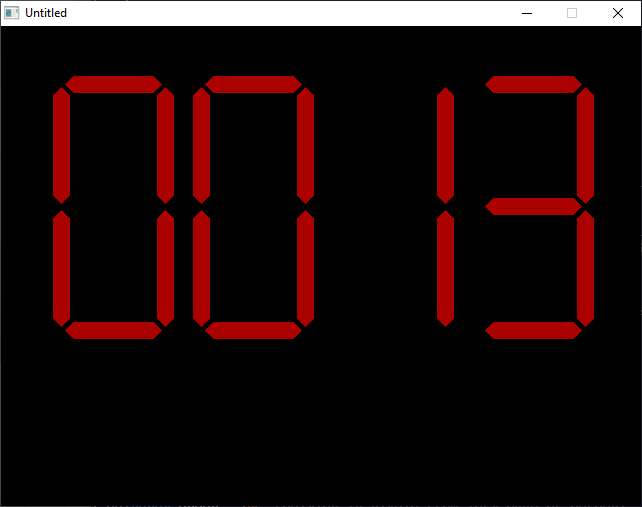

[Home](https://qb64.com) • [News](../../news.md) • [GitHub](https://github.com/QB64Official/qb64) • [Wiki](https://github.com/QB64Official/qb64/wiki) • [Samples](../../samples.md) • [InForm](../../inform.md) • [GX](../../gx.md) • [QBjs](../../qbjs.md) • [Community](../../community.md) • [More...](../../more.md)

## SAMPLE: BIG LEDS



### Author

[🐝 Scott Edwards](../scott-edwards.md) 

### Description

```text
' BIG_LEDS.BAS
' by Scott Edwards
' Copyright (C) 1994 DOS World Magazine
' Published in Issue #19, January 1995, page 62

***************************************************************************** 
 
 BIG_LEDS.BAS 
   by Scott Edwards 
 Copyright (C) 1994 DOS World Magazine 
 Published in Issue #19, January 1995, page 62 
 
If you've ever wanted your QBasic programs to display GIANT numbers on your  
display, this program is for you.  BIG_LEDS.BAS demonstrates the usage of two  
subroutines, DISPLAY and LED, that display large numbers that look like the  
LED display on a digital clock or wrist watch.  The demo program displays a  
four-digit value as it counts from zero to 9999, updating the display once  
per second.  You can stop the demo at any time by pressing any key. 
To run the program from the DOS command line, change to the directory  
containing BIG_LEDS.BAS, then type: 
 
QBASIC /RUN BIG_LEDS 
 
 
Like a real LED (light emitting diode) display, each numeral displayed by  
this program consists of seven segments, each of which can be on or off.  The  
number 8, for example. uses all seven segments: 
 
     **** 
    *    * 
    *    * 
     **** 
    *    * 
    *    * 
     **** 
 
The DISPLAY subroutine extracts the digits of the number you want to display,  
converts it to a bit pattern and feeds it to the LED subroutine.  The LED  
subroutine turns each segment on or off according to the pattern of bits  
provided in the integer variable SEGS%. 
 
The demo program's main loop consists of just five lines: 
 
FOR X = 0 TO 9999 
  DISPLAY (X): SLEEP 1 
  IF INKEY$ <> "" THEN SYSTEM 
NEXT X 
END 
 
This FOR...NEXT loop counts from 0 to 9999 and calls the DISPLAY subroutine  
each time through the loop.  If you press any key, the program exits back to  
the QBasic environment. 
 
You may customize the program by changing the values of the constants that  
set the color, size, and screen position of the LED numerals.  The constant  
SCALE controls the spacing of the numerals.  Only four values are useful:  
1(small), 2(medium), 3(huge), and 4(jumbo).  If you change SCALE, you must  
also change the "Sn" value for constants A$ through G$.  If you set SCALE to  
1, for instance, the line that sets the value of A$ must be changed to: 
 
CONST A$ = "S1 B M+0,-242 B R4 E8 R80 F8 G8 L80 H8 B R10" 
 
In this example, S4 was changed to S1 because SCALE was changed from 4 to 1. 
 
You may change the color of the numerals by altering the value of the  
constant LIT. Values of 1 through 15 are permissible.  To change the location  
at which the numerals are displayed, substitute new values for the constants  
XBASE and YBASE.  Reducing XBASE moves the display to the left, increasing it  
moves the display to the right.  Reducing YBASE moves the display up,  
increasing it moves the display down. 
 
To use these routines in a program of your own, add the entire BIG_LEDS.BAS  
listing to your program, except for the five lines shown above that comprise  
the main program loop of the demo program.  The easiest way to do this is to  
Open BIG_LEDS.BAS in QBasic, Copy the relevant portions of the listing, Open  
your program, and Paste the copied portion of BIG_LEDS.BAS into your program.   
Now anytime you want to display a BIG number, insert the statement Display  
(X) into your program, after first setting X equal to the number you wish to  
display.
```

### QBjs

> Please note that QBjs is still in early development and support for these examples is extremely experimental (meaning will most likely not work). With that out of the way, give it a try!

* [LOAD "big_leds.bas"](https://qbjs.org/index.html?src=https://qb64.com/samples/big-leds/src/big_leds.bas)
* [RUN "big_leds.bas"](https://qbjs.org/index.html?mode=auto&src=https://qb64.com/samples/big-leds/src/big_leds.bas)
* [PLAY "big_leds.bas"](https://qbjs.org/index.html?mode=play&src=https://qb64.com/samples/big-leds/src/big_leds.bas)

### File(s)

* [big_leds.bas](src/big_leds.bas)

🔗 [clock](../clock.md), [dos world](../dos-world.md)
