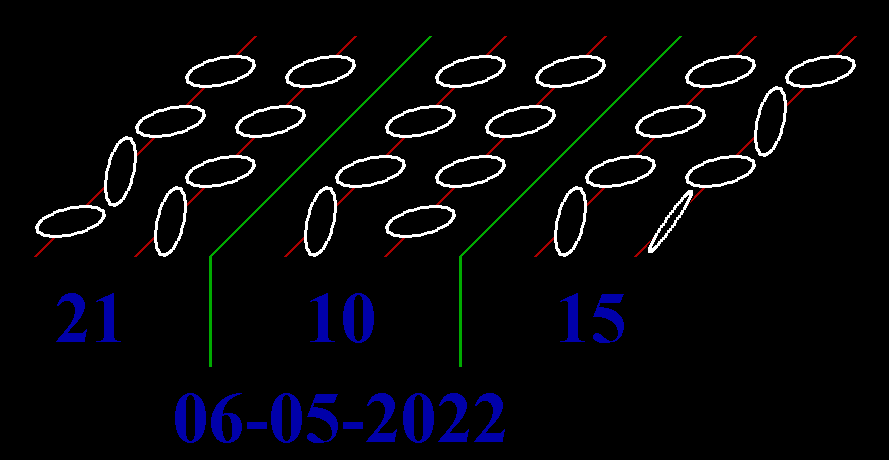

[Home](https://qb64.com) • [News](../../news.md) • [GitHub](../../github.md) • [Wiki](../../wiki.md) • [Samples](../../samples.md) • [Media](../../media.md) • [Community](../../community.md) • [Rolodex](../../rolodex.md) • [More...](../../more.md)

## SAMPLE: BINARY CLOCK



### Author

[🐝 Rho Sigma](../rho-sigma.md) 

### Description

```text
'+---------------+---------------------------------------------------+
'|_######_######_|_____.--._._________.-.____________________________|
'|_##__##_##___#_|_____|___)|________(___)_o_________________________|
'|_##__##__##____|_____|--'_|--._.-.__`-.__.__.-...--.--._.-.________|
'|_######___##___|_____|__\_|__|(___)(___)_|_(___||__|__|(___)_______|
'|_##______##____|_____'___`'__`-`-'__`-'-'_`-`-`|'__'__`-`-'`-______|
'|_##_____##___#_|____________________________._.'___________________|
'|_##_____######_|__Sources_&_Documents_placed_in_the_Public_Domain._|
'+---------------+---------------------------------------------------+
'|                                                                   |
'| === ScreenBlankers-Info.html ===                                  |
'|                                                                   |
'| == Some simple screen blankers I wrote using QB64.                |
'|                                                                   |
'+-------------------------------------------------------------------+
'| Done by RhoSigma, R.Heyder, provided AS IS, use at your own risk. |
'| Find me in the QB64 Forum or mail to support@rhosigma-cw.net for  |
'| any questions or suggestions. Thanx for your interest in my work. |
'+-------------------------------------------------------------------+
Screen Blankers
This is a small collection of some simple screen blanker modules. Most of them are written by myself, others were just graphic sample programs from other QB64 Forum members, which I've altered into a blanker module. Just read the header notes in each module for more information.

To install one of it (on a Windows system), simply rename the created .exe file with the new extension .scr, confirm the possible warning about changing the file extension with Yes. After that you can simply right click on the renamed file and choose Install.

Sorry, I've no idea how to do it on MacOS or Linux, any info about it from people who using these systems would be nice.
```

### Code

#### binclock.bas

```vb

'+---------------+---------------------------------------------------+
'| ###### ###### |     .--. .         .-.                            |
'| ##  ## ##   # |     |   )|        (   ) o                         |
'| ##  ##  ##    |     |--' |--. .-.  `-.  .  .-...--.--. .-.        |
'| ######   ##   |     |  \ |  |(   )(   ) | (   ||  |  |(   )       |
'| ##      ##    |     '   `'  `-`-'  `-'-' `-`-`|'  '  `-`-'`-      |
'| ##     ##   # |                            ._.'                   |
'| ##     ###### |  Sources & Documents placed in the Public Domain. |
'+---------------+---------------------------------------------------+
'|                                                                   |
'| === BinClock.bas ===                                              |
'|                                                                   |
'| == A simple binary (BCD) clock inspired by the alien countdown    |
'| == from the movie "Mission to Mars".                              |
'|                                                                   |
'+-------------------------------------------------------------------+
'| Done by RhoSigma, R.Heyder, provided AS IS, use at your own risk. |
'| Find me in the QB64 Forum or mail to support@rhosigma-cw.net for  |
'| any questions or suggestions. Thanx for your interest in my work. |
'+-------------------------------------------------------------------+

'get desktop sizes
di& = _ScreenImage
desX% = _Width(di&)
desY% = _Height(di&)
scrX% = _Width(di&): If scrX% < 875 Then scrX% = 875
scrY% = _Height(di&): If scrY% < 465 Then scrY% = 465
_FreeImage di&
Dim Shared scale%, timg&
If desX% <> scrX% Or desY% <> scrY% Then scale% = -1: Else scale% = 0

'setup screen
Screen _NewImage(desX%, desY%, 256)
_Delay 0.2: _ScreenMove _Middle
_Delay 0.2: _FullScreen
If scale% Then
    timg& = _NewImage(scrX%, scrY%, 256)
    If timg& < -1 Then _Dest timg&: Else System
End If
scrFont& = _LoadFont("C:\Windows\Fonts\timesbd.ttf", 72)
_Font scrFont&

'3D space origin is on these screen coordinates
Dim Shared dx%: dx% = (scrX% - 875) \ 2
Dim Shared dy%: dy% = (scrY% - 465) \ 2
Dim Shared cx%: cx% = 30 + dx%
Dim Shared cy%: cy% = 250 + dy%

'init BCD discs
Type Disc
    x As Integer
    y As Integer
    z As Integer
    r As Integer
    a As Integer
End Type
Dim Shared Discs(23) As Disc
InitDiscs
Dim Shared curState&: curState& = 0
Dim Shared newState&: newState& = 0

'draw hour/minute/seconds separators
Line3D 175, 0, 0, 175, 440, 0, 2
Line3D 175, 0, 0, 175, 0, -110, 2
Line3D 425, 0, 0, 425, 440, 0, 2
Line3D 425, 0, 0, 425, 0, -110, 2

'main loop
_MouseHide
_Display
Do
    _Limit 1
    FlipDiscs
    Do While _MouseInput
        mx% = mx% + _MouseMovementX
        my% = my% + _MouseMovementY
    Loop
Loop While InKey$ = "" And mx% = 0 And my% = 0
_AutoDisplay

'cleanup
_Font 16
_FreeFont scrFont&
If scale% Then _FreeImage timg&
System

'run the clock
Sub FlipDiscs
    t$ = Time$
newState& = (VAL(MID$(t$, 1, 1)) * (2 ^ 20)) + (VAL(MID$(t$, 2, 1)) * (2 ^ 16)) +_
            (VAL(MID$(t$, 4, 1)) * (2 ^ 12)) + (VAL(MID$(t$, 5, 1)) * (2 ^ 8)) +_
            (VAL(MID$(t$, 7, 1)) * (2 ^ 4)) + (VAL(MID$(t$, 8, 1)) * (2 ^ 0))
    diff& = curState& Xor newState&
    curState& = newState&
    For rot% = 5 To 90 Step 5
        For n% = 0 To 23
            If (n% Mod 4) = 0 Then AxisSegments Discs(n%).x
            If diff& And (2 ^ n%) Then
                Circle3D Discs(n%).x, Discs(n%).y, Discs(n%).z, Discs(n%).r, Discs(n%).a, 0
                Circle3D Discs(n%).x, Discs(n%).y, Discs(n%).z, Discs(n%).r, Discs(n%).a + 5, 15
                Discs(n%).a = Discs(n%).a + 5
                If Discs(n%).a = 180 Then Discs(n%).a = 0
            Else
                Circle3D Discs(n%).x, Discs(n%).y, Discs(n%).z, Discs(n%).r, Discs(n%).a, 15
            End If
        Next n%
        If rot% = 60 Then
            Color 1
            _PrintString (50 + dx%, 280 + dy%), Mid$(t$, 1, 2)
            _PrintString (300 + dx%, 280 + dy%), Mid$(t$, 4, 2)
            _PrintString (550 + dx%, 280 + dy%), Mid$(t$, 7, 2)
            _PrintString (300 - _PrintWidth(Left$(Date$, 4)) + dx%, 380 + dy%), Date$
        End If
        If scale% Then _PutImage , timg&, 0
        _Display
    Next rot%
End Sub

'setup start values for all discs
Sub InitDiscs
    n% = 0
    For i% = 600 To 500 Step -100
        For j% = 70 To 370 Step 100
            Discs(n%).x = i%
            Discs(n%).y = j%
            Discs(n%).z = 0
            Discs(n%).r = 30
            Discs(n%).a = 0
            n% = n% + 1
        Next j%
    Next i%
    For i% = 350 To 250 Step -100
        For j% = 70 To 370 Step 100
            Discs(n%).x = i%
            Discs(n%).y = j%
            Discs(n%).z = 0
            Discs(n%).r = 30
            Discs(n%).a = 0
            n% = n% + 1
        Next j%
    Next i%
    For i% = 100 To 0 Step -100
        For j% = 70 To 370 Step 100
            Discs(n%).x = i%
            Discs(n%).y = j%
            Discs(n%).z = 0
            Discs(n%).r = 30
            Discs(n%).a = 0
            n% = n% + 1
        Next j%
    Next i%
End Sub

'draw rotation axis segments between discs
Sub AxisSegments (x%)
    Line3D x%, 0, 0, x%, 40, 0, 4
    Line3D x%, 100, 0, x%, 140, 0, 4
    Line3D x%, 200, 0, x%, 240, 0, 4
    Line3D x%, 300, 0, x%, 340, 0, 4
    Line3D x%, 400, 0, x%, 440, 0, 4
End Sub

Sub Line3D (x1%, y1%, z1%, x2%, y2%, z2%, col%)
    'x1%/y1%/z1% = start, x2%/y2%/z2% = end, col% = color pen
    x1# = (x1% + (y1% * 0.5)): z1# = (z1% + (y1% * 0.5))
    x2# = (x2% + (y2% * 0.5)): z2# = (z2% + (y2% * 0.5))
    Line (x1# + cx% - 1, -z1# + cy%)-(x2# + cx% - 1, -z2# + cy%), col%
    Line (x1# + cx%, -z1# + cy%)-(x2# + cx%, -z2# + cy%), col%
    Line (x1# + cx% + 1, -z1# + cy%)-(x2# + cx% + 1, -z2# + cy%), col%
End Sub

Sub Circle3D (x%, y%, z%, r%, ba%, col%)
    'x%/y%/z% = center, r% = radius, ba% = B-Axis angle, col% = color pen
    mx# = (x% + (y% * 0.5)): mz# = (z% + (y% * 0.5))
    zx# = r% * Cos(ba% * 0.017453292519943)
    zz# = r% * Sin(ba% * 0.017453292519943)
    For cir% = 0 To 359 Step 5
        x# = zx# * Cos(cir% * 0.017453292519943)
        y# = r% * Sin(cir% * 0.017453292519943)
        z# = zz# * Cos(cir% * 0.017453292519943)
        x# = (x# + (y# * 0.5)): z# = (z# + (y# * 0.5))
        Line (x# + mx# + cx% - 1, -z# + -mz# + cy% - 1)-(x# + mx# + cx% + 1, -z# + -mz# + cy% + 1), col%, BF
    Next cir%
End Sub

```

### File(s)

* [binclock.bas](src/binclock.bas)

🔗 [screenblanker](../screenblanker.md)
