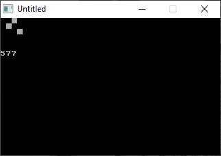

[Home](https://qb64.com) • [News](../../news.md) • [GitHub](https://github.com/QB64Official/qb64) • [Wiki](https://github.com/QB64Official/qb64/wiki) • [Samples](../../samples.md) • [InForm](../../inform.md) • [GX](../../gx.md) • [QBjs](../../qbjs.md) • [Community](../../community.md) • [More...](../../more.md)

## SAMPLE: BINARY COUNTER



### Author

[🐝 rpgfan3233](../rpgfan3233.md) 

### Description

```text
' This program is a 12-bit Binary counter, displayed using a 3x4 grid.
' It was created in the honour of an old acquaintance who became
'   obsessed with the binary number system.
'
' It uses extended character code 219 from IBM code page 437 to render
'   the ON state and a simple space (character code 32) to render the
'   OFF state.
```

### QBjs

> Please note that QBjs is still in early development and support for these examples is extremely experimental (meaning will most likely not work). With that out of the way, give it a try!

* [LOAD "binarycounter.bas"](https://qbjs.org/index.html?src=https://qb64.com/samples/binary-counter/src/binarycounter.bas)
* [RUN "binarycounter.bas"](https://qbjs.org/index.html?mode=auto&src=https://qb64.com/samples/binary-counter/src/binarycounter.bas)
* [PLAY "binarycounter.bas"](https://qbjs.org/index.html?mode=play&src=https://qb64.com/samples/binary-counter/src/binarycounter.bas)

### File(s)

* [binarycounter.bas](src/binarycounter.bas)

🔗 [binary](../binary.md), [counter](../counter.md), [qbjs](../qbjs.md)
