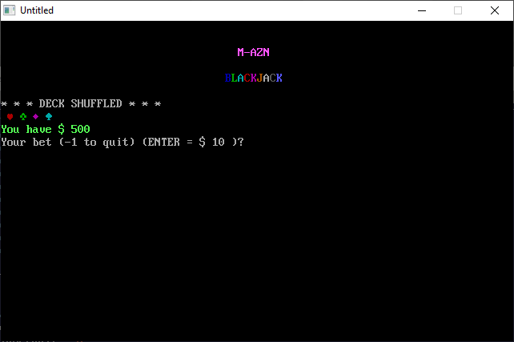

[Home](https://qb64.com) • [News](../../news.md) • [GitHub](https://github.com/QB64Official/qb64) • [Wiki](https://github.com/QB64Official/qb64/wiki) • [Samples](../../samples.md) • [InForm](../../inform.md) • [GX](../../gx.md) • [QBjs](../../qbjs.md) • [Community](../../community.md) • [More...](../../more.md)

## SAMPLE: BLACKJACK



### Author

[🐝 M-AZN](../m-azn.md) 

### Description

```text
REM M-AZN BLACKJACK
REM May 27, 2005
REM by M-AZN
REM
REM dealer hits on 16, stands on 17.
REM bet*0.5 bonus for blackjack (Ace and value-10 card)
REM when betting, you can press ENTER to bid last bet--
REM unless you cant afford it. double-down doubles your bet for that play.
REM to quit, enter -1 when betting, or enter q or Q at hit/stand/double.
REM ENTER is same as stand. S to stand. H to hit. D to double down.
REM can't split (yet).
```

### QBjs

> Please note that QBjs is still in early development and support for these examples is extremely experimental (meaning will most likely not work). With that out of the way, give it a try!

* [LOAD "bj.bas"](https://qbjs.org/index.html?src=https://qb64.com/samples/blackjack/src/bj.bas)
* [RUN "bj.bas"](https://qbjs.org/index.html?mode=auto&src=https://qb64.com/samples/blackjack/src/bj.bas)
* [PLAY "bj.bas"](https://qbjs.org/index.html?mode=play&src=https://qb64.com/samples/blackjack/src/bj.bas)

### File(s)

* [bj.bas](src/bj.bas)

🔗 [game](../game.md), [blackjack](../blackjack.md), [legacy](../legacy.md)
