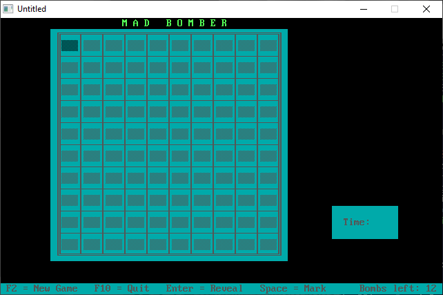

[Home](https://qb64.com) • [News](../../news.md) • [GitHub](https://github.com/QB64Official/qb64) • [Wiki](https://github.com/QB64Official/qb64/wiki) • [Samples](../../samples.md) • [InForm](../../inform.md) • [GX](../../gx.md) • [QBjs](../../qbjs.md) • [Community](../../community.md) • [More...](../../more.md)

## SAMPLE: BOMBER



### Author

[🐝 Doug Lowe](../doug-lowe.md) 

### Description

```text
' BOMBER.BAS by Doug Lowe
' Copyright (C) 1994 DOS Resource Guide. Sept. 1994 issue, page 58

***************************************************************************** 
 
 BOMBER.BAS 
   by Doug Lowe 
 Copyright (C) 1994 DOS Resource Guide 
 Published in Issue #17, September 1994, page 58 
 
Remember that scene in Raiders of the Lost Ark where Indiana Jones works his  
way cautiously across the room to retrieve a priceless artifact--while  
carefully avoiding the booby-trapped floor tiles? One wrong step and he's  
history. 
 
This QBasic program, Mad Bomber, works on a similar premise. Hidden within a  
10-by-10-square playing field are 15 bombs. Your job is to pinpoint the  
location of each one without "stepping" on any of them. If you keep your  
head, you'll come out a winner, but make one mistake and the game's up. 
 
To run the program from the DOS command line, change to the directory  
containing BOMBER.BAS, then type: 
 
QBASIC /RUN BOMBER 
 
 
BOMBER.BAS starts by clearing the screen and drawing the playing field. To  
play the game, you uncover squares on the grid one by one, using the arrow  
keys to move to a particular square and highlight it. If you don't think the  
highlighted square contains a bomb, press the Enter key to reveal its  
contents; press the spacebar to mark a square as the site of a bomb. 
 
Play continues until you press F10 to quit the game, press F2 to begin a new  
round of Mad Bomber, pinpoint correctly the locations of all 15 bombs, or  
press Enter on a square within which a bomb is hidden. 
 
As you uncover squares that don't contain bombs, the game rewards you with  
clues. A blank square indicates that the eight squares surrounding the empty  
one (three above, three below, and one on either side) are free of bombs. A  
numeral (1 through 8) tells you the number of bombs housed in the eight  
surrounding squares. 
 
For example, if you uncover a square containing a 2, you know that two of the  
surrounding eight squares hold bombs and six don't. The trick, of course, is  
figuring out which of the surrounding squares contain the bombs. To win  
you'll need to rely on old-fashioned deductive reasoning, with an occasional  
calculated risk and a bit of luck. 
 
The results of your first few moves depend on chance. In fact, because 15 of  
the 100 squares contain bombs, there's a roughly 1:15 chance that you'll lose  
the game on your first move. If your luck holds and you uncover two or three  
squares successfully, you should accumulate enough clues to begin pinpointing  
bombs and uncovering empty squares. 
 
But beware: The game lets you mark as many squares as you want. A counter in  
the bar at the bottom of the screen tells you the number of bombs remaining  
unmarked. 
 
The counter starts at 15 and is decremented by one each time you mark a  
square, even if you mark it incorrectly. (If you realize you've made a  
mistake, you may unmark a square by highlighting it and pressing Enter  
again.) If you mark more than 15 squares, the counter displays a negative  
number. 
 
If you're lucky (or smart) enough to uncover a square with no adjacent bombs,  
the program uncovers all eight surrounding squares automatically. If any of  
those new squares have no adjacent bombs, those squares are uncovered, as  
well. Sometimes, a lucky move will uncover half the grid, providing numerous  
clues to the locations of the remaining bombs. 
 
To win the game, you must uncover all 85 empty squares. To up the pressure, a  
timer starts counting off seconds as soon as you uncover your first square.  
You'll know you're good when you can win a round of Mad Bomber in about 45  
seconds. (If you're acquainted with Windows 3.1, you may recognize the  
similarities between the rules for Mad Bomber and those for Minesweeper, one  
of the free games that comes with Windows.) 
 
Program Highlights 
------------------ 
Two arrays are used to track the playing grid. The first, GRID, contains the  
contents of each grid square: A number from zero to 8 indicates the number of  
bombs adjacent to the square, and a value of 9 indicates that the square  
contains a bomb. The second array, SHOW, keeps track of whether you've  
uncovered or marked a square. 
 
Both arrays are defined as 12-by-12 matrices, even though the game field is  
only a 10-by-10 matrix. The outer edge of each array (all cells in row zero  
and row 11 and all cells in column zero and column 11) is ignored. This  
design simplifies the logic of the subprogram InitializeGame, particularly  
the section that counts the number of bombs adjacent to each cell within the  
playing field. Had GRID been defined as a 10-by-10 matrix, the program would  
need additional boundary checks throughout that routine. 
 
In addition to drawing the game board, the subprogram InitializeGame  
randomizes the location of the 15 bombs, then, based on bomb placement,  
calculates the number (zero to 8) to store in the other cells of the grid.  
ShowGridItem displays a particular grid square. If the player uncovers the  
square, this routine displays the square's contents. If the player marks the  
cell, it displays the mark; otherwise, it displays a block to indicate that  
the player hasn't uncovered or marked the square. The third parameter passed  
to this subprogram, mode, helps determine which color to display in the  
square. If the value of mode is 1, the colors are inverted, which highlights  
the square. 
 
The program's most interesting routine is ShowNeighbors, a subprogram called  
whenever the player uncovers a blank square. ShowNeighbors first uncovers all  
eight adjacent squares (assuming that the square doesn't lie on the edge of  
the grid). If one of the neighboring cells is also blank, the subprogram  
calls itself and uncovers another set of neighboring cells. This technique,  
called recursion, isn't used commonly in QBasic programs. But in this case,  
it's the most efficient way to uncover empty squares. 
 
Making It Better 
---------------- 
If you want to tinker with QBasic, Mad Bomber offers several do-it-yourself  
opportunities. The first of these home-improvement projects--increasing the  
level of difficulty by increasing the number of bombs--is simple, because a  
CONST statement is used to establish the number of bombs. As noted above, the  
program as written hides 15 bombs. To increase the number of bombs,  
substitute a higher value in the CONST statement near the beginning of the  
program. For example, if you change the CONST statement to read as follows: 
 
CONST NUMBOMBS = 20 
 
the program hides 20 bombs within the playing field. 
 
There are three other obvious enhancements to Mad Bomber. First, you could  
track high scores by writing outcomes to a file. Second, you could allow the  
player to vary the size of the grid. Finally, you might investigate ways to  
eliminate the 1:15 chance of losing on the first move. 
 
Keeping track of the best scores would mean storing the highest ones in a  
file, which entails adding statements to open the file, reading the previous  
best score, comparing it with the current player's score, and updating the  
file with new information if the player beats the previous best score. In  
addition, you'd want to add a routine that displays a congratulatory message  
and asks for the player's name, which you'd show on screen beside the score. 
 
Increasing the size of the playing field would involve extensive changes to  
the routines in InitializeGame that draw the board and randomize it, as well  
as modifications to the routines that move that little cursor around the  
screen. Because each square on the grid requires three display lines and five  
display columns, a 10-by-10 matrix is about the largest game board you can  
create with the screen in 25-line mode. To create a larger board, you'd have  
to switch the display to 43-line mode. 
 
And to eliminate the possibility of uncovering a bomb right off the bat, you  
could rewrite the program so that it randomizes the grid after the first  
move. 
 
All these changes would improve the program, but none of them is absolutely  
essential--you'll still get plenty of hours of playing fun running Mad Bomber  
just as it is.
```

### QBjs

> Please note that QBjs is still in early development and support for these examples is extremely experimental (meaning will most likely not work). With that out of the way, give it a try!

* [LOAD "bomber.bas"](https://qbjs.org/index.html?src=https://qb64.com/samples/bomber/src/bomber.bas)
* [RUN "bomber.bas"](https://qbjs.org/index.html?mode=auto&src=https://qb64.com/samples/bomber/src/bomber.bas)
* [PLAY "bomber.bas"](https://qbjs.org/index.html?mode=play&src=https://qb64.com/samples/bomber/src/bomber.bas)

### File(s)

* [bomber.bas](src/bomber.bas)

🔗 [game](../game.md), [dos world](../dos-world.md)
