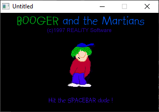

[Home](https://qb64.com) • [News](../../news.md) • [GitHub](https://github.com/QB64Official/qb64) • [Wiki](https://github.com/QB64Official/qb64/wiki) • [Samples](../../samples.md) • [InForm](../../inform.md) • [GX](../../gx.md) • [QBjs](../../qbjs.md) • [Community](../../community.md) • [More...](../../more.md)

## SAMPLE: BOOGER



### Author

[🐝 REALiTY Software](../reality-software.md) 

### Description

```text
Rem
Rem
Rem             REALiTY Software
Rem
Rem         BOOGER and the Martians
Rem
Rem
Rem             Coded By M.Ware
Rem
Rem
Rem SWFX & GIF Routines used (Thanks dudes !!)
Rem
Rem   All other coding by REALiTY Software
Rem
Rem
Rem
Rem This is the 1st game from REALiTY Software
Rem soon to be one of many ,i already have another BOOGER
Rem game in the pipeline and have began work on it
Rem hopefully it wont be too long coming.
Rem
Rem BOOGER and the Martians was written in QB4.5 on a 133Mhz
Rem Pentium but should run on anything Pentium even 486 im not
Rem sure about 386's etc maybe you could EMAIL me about how
Rem it works on another machine ?
Rem
Rem Anyone out there who knows how to program music ,mail me please
Rem i havent dabbled in it yet but someone who knows can save a
Rem lot of time !.
Rem
Rem Hope you enjoy the GAME sorry there are not many REMARKS but hey
Rem thats one of the joys of programming !.
Rem
Rem Best of luck ..........................
Rem
Rem P.S Maybe someone would like to join forces and make a really
Rem     really really good game ???
Rem
Rem EMail me on : Matthew.Ware@virgin.net
Rem
Rem As Booger would say L8rs DUDES !!!
```

### QBjs

> Please note that QBjs is still in early development and support for these examples is extremely experimental (meaning will most likely not work). With that out of the way, give it a try!

* [LOAD "booger.bas"](https://qbjs.org/index.html?src=https://qb64.com/samples/booger/src/booger.bas)
* [RUN "booger.bas"](https://qbjs.org/index.html?mode=auto&src=https://qb64.com/samples/booger/src/booger.bas)
* [PLAY "booger.bas"](https://qbjs.org/index.html?mode=play&src=https://qb64.com/samples/booger/src/booger.bas)

### File(s)

* [booger.bas](src/booger.bas)
* [booger.zip](src/booger.zip)

🔗 [game](../game.md), [legacy](../legacy.md)
