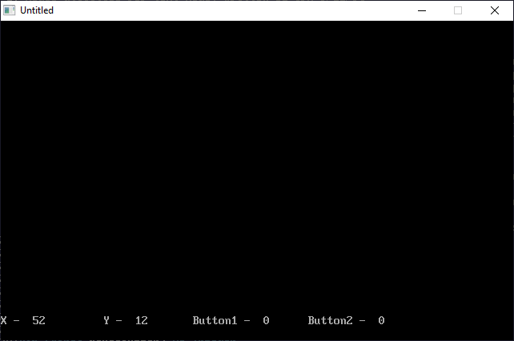

[Home](https://qb64.com) • [News](../../news.md) • [GitHub](https://github.com/QB64Official/qb64) • [Wiki](https://github.com/QB64Official/qb64/wiki) • [Samples](../../samples.md) • [InForm](../../inform.md) • [GX](../../gx.md) • [QBjs](../../qbjs.md) • [Community](../../community.md) • [More...](../../more.md)

## SAMPLE: CABSMOUSE



### Description

```text
'Mouse utilities for text mode. Written by TFM 9/11/94
'Uses INT 33 to use a Microsoft Compatable mouse driver
'Written in basic calling an assembly language routine.
'Works in normal basic
```

### QBjs

> Please note that QBjs is still in early development and support for these examples is extremely experimental (meaning will most likely not work). With that out of the way, give it a try!

* [LOAD "cabsmous.bas"](https://qbjs.org/index.html?src=https://qb64.com/samples/cabsmouse/src/cabsmous.bas)
* [RUN "cabsmous.bas"](https://qbjs.org/index.html?mode=auto&src=https://qb64.com/samples/cabsmouse/src/cabsmous.bas)
* [PLAY "cabsmous.bas"](https://qbjs.org/index.html?mode=play&src=https://qb64.com/samples/cabsmouse/src/cabsmous.bas)

### File(s)

* [cabsmous.bas](src/cabsmous.bas)

🔗 [mouse](../mouse.md), [legacy](../legacy.md)
