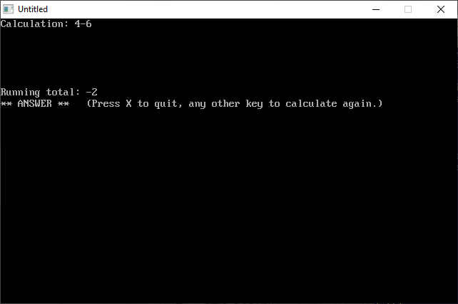
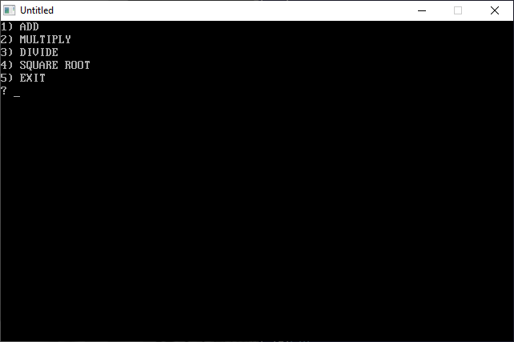
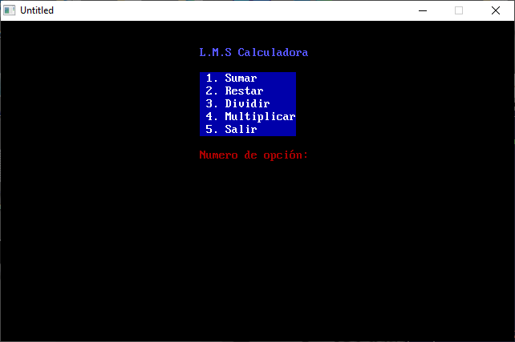

[Home](https://qb64.com) • [News](../../news.md) • [GitHub](https://github.com/QB64Official/qb64) • [Wiki](https://github.com/QB64Official/qb64/wiki) • [Samples](../../samples.md) • [InForm](../../inform.md) • [GX](../../gx.md) • [QBjs](../../qbjs.md) • [Community](../../community.md) • [More...](../../more.md)

## SAMPLE: CALC DW



### Author

[🐝 William Loughner](../william-loughner.md) 

### Description

```text
'   CALC.BAS
'      by William Loughner
'   Copyright (c) 1994 DOS Resource Guide
'   Published in Issue #14, March 1994, page 58

==============================================================================

----------
 CALC.BAS
----------
SYSTEM REQUIREMENTS:
The version of QBasic that comes with DOS 5 or later, or Microsoft Quick Basic 
4.x.

WHAT CALC.BAS DOES:
CALC.BAS is a simple calculator program that you can use whenever you need to 
make arithmetic calculations involving addition, subtraction, multiplication, 
division, and raising to a power (exponentiation).

USING CALC.BAS
To load the program, type QBASIC CALC.BAS (using path names if necessary) at 
the DOS prompt. Then run the program by selecting the Start option in QBasic's 
Run menu, or press Shift-F5.  After clearing the screen, CALC.BAS displays a 
line where you may enter your calculation and a second line that keeps a 
running total for you.  Like a standard calculator, it displays keystrokes as 
you type them and evaluates expressions from left to right.  When you type the 
equal sign (=) or press Enter, the program clears the calculation, tells you 
that the running total is the answer, and reminds you what keystrokes to press 
to proceed.

Permissible keystrokes are the numbers from zero to 9; a decimal point; the 
operators for addition, subtraction, multiplication, division, and raising to 
a power (+, -, *, /, and ^); open and close parentheses (); open and close 
brackets []; an equal sign; Enter; and an upper- or lowercase "x."  If you 
press other keys, CALC.BAS issues an error message.  Typing x or X ends the 
program.

CALC.BAS can handle one level of parentheses.  An open parentheses sets the 
running total to zero, and a close parentheses resets the running total to 
that of the entire expression.

To access CALC.BAS quickly and easily, create the following one-line batch 
file, and place it in your C:\BATCH directory:

@QBASIC /RUN CALC

If you name this batch file CALC.BAT and include the C:\BATCH directory in the 
PATH statement in your AUTOEXEC.BAT file, you can start QBasic and run 
CALC.BAS by typing CALC at the DOS prompt.

For further details on CALC.BAS, see "It All Adds Up" (Readers' Queue, DRG 
#14, March 1994, page 58).
```

### File(s)

* [calc.bas](src/calc.bas)
* [calc_2.bas](src/calc_2.bas)

### Additional Image(s)




🔗 [calculator](../calculator.md), [dos world](../dos-world.md)
