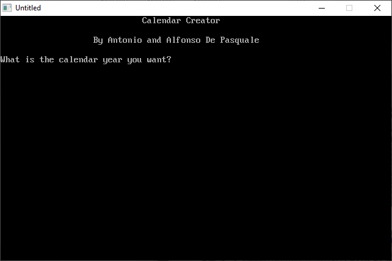

[Home](https://qb64.com) • [News](../../news.md) • [GitHub](https://github.com/QB64Official/qb64) • [Wiki](https://github.com/QB64Official/qb64/wiki) • [Samples](../../samples.md) • [InForm](../../inform.md) • [GX](../../gx.md) • [QBjs](../../qbjs.md) • [Community](../../community.md) • [More...](../../more.md)

## SAMPLE: CALENDAR



### Author

[🐝 A&A De Pasquale](../a&a-de-pasquale.md) 

### Description

```text
' Antonio & Alfonso De Pasquale
' Copyright (C) 1993 DOS Resource Guide
' Published in Issue #8, March 1993, page 47

==============================================================================

--------------
 CALENDAR.BAS
--------------
SYSTEM REQUIREMENTS:
The version of QBasic that comes with DOS 5 or later, or Microsoft Quick Basic 
4.x, and a dot-matrix or HP LaserJet-compatible printer.

WHAT CALENDAR.BAS DOES:
This QBasic program lets you print out a full year's calendar on a single 
page. CALENDAR.BAS accounts for leap years and works for 1753 and any year 
thereafter.

USING CALENDAR.BAS:
To load the program, type QBASIC CALENDAR.BAS (using path names if necessary) 
at the DOS prompt. Then run the program by selecting the Start option in 
QBasic's Run menu, or press Shift-F5. The screen clears, and a greeting 
appears. The program then asks you to enter the year for which you want a 
calendar.

When you enter an acceptable year, the program performs its calculations and 
reminds you to make sure your printer is turned on and on line. Press Enter to 
begin printing the calendar. The program displays a message when printing 
finishes.

For further details on CALENDAR.BAS, see "The Perpetual Calendar" (DRG #8, 
March 1993, page 47).
```

### QBjs

> Please note that QBjs is still in early development and support for these examples is extremely experimental (meaning will most likely not work). With that out of the way, give it a try!

* [LOAD "calendar.bas"](https://qbjs.org/index.html?src=https://qb64.com/samples/calendar/src/calendar.bas)
* [RUN "calendar.bas"](https://qbjs.org/index.html?mode=auto&src=https://qb64.com/samples/calendar/src/calendar.bas)
* [PLAY "calendar.bas"](https://qbjs.org/index.html?mode=play&src=https://qb64.com/samples/calendar/src/calendar.bas)

### File(s)

* [calendar.bas](src/calendar.bas)

🔗 [calendar](../calendar.md), [pdf](../pdf.md), [dos world](../dos-world.md)
