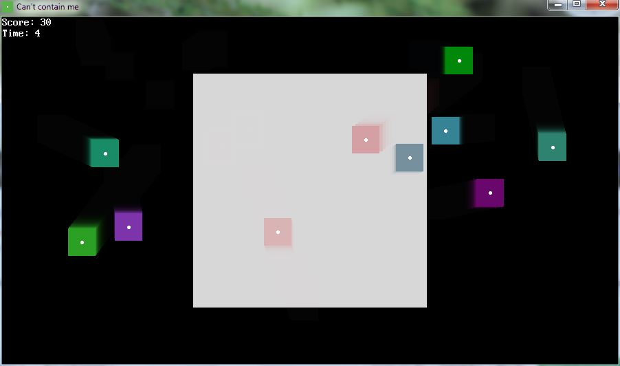

[Home](https://qb64.com) • [News](../../news.md) • [GitHub](https://github.com/QB64Official/qb64) • [Wiki](https://github.com/QB64Official/qb64/wiki) • [Samples](../../samples.md) • [InForm](../../inform.md) • [GX](../../gx.md) • [QBjs](../../qbjs.md) • [Community](../../community.md) • [More...](../../more.md)

## SAMPLE: CANT CONTAIN ME



### Author

[🐝 Fellippe Heitor](../fellippe-heitor.md) 

### Description

```text
Can't Contain Me is a game developed in QB64.

The pieces are trying to escape your screen and the container that'll hold them back from leaving is in the center of the window. Drag as many fugitives as you can into the cell (even multiple at once) so you can win.
```

### QBjs

> Please note that QBjs is still in early development and support for these examples is extremely experimental (meaning will most likely not work). With that out of the way, give it a try!

* [LOAD "ccm.bas"](https://qbjs.org/index.html?src=https://qb64.com/samples/cant-contain-me/src/ccm.bas)
* [RUN "ccm.bas"](https://qbjs.org/index.html?mode=auto&src=https://qb64.com/samples/cant-contain-me/src/ccm.bas)
* [PLAY "ccm.bas"](https://qbjs.org/index.html?mode=play&src=https://qb64.com/samples/cant-contain-me/src/ccm.bas)

### File(s)

* [cant-contain-me.zip](src/cant-contain-me.zip)
* [ccm.bas](src/ccm.bas)

🔗 [game](../game.md)


<sub>Reference: [github.com](https://github.com/FellippeHeitor/cant-contain-me) </sub>
