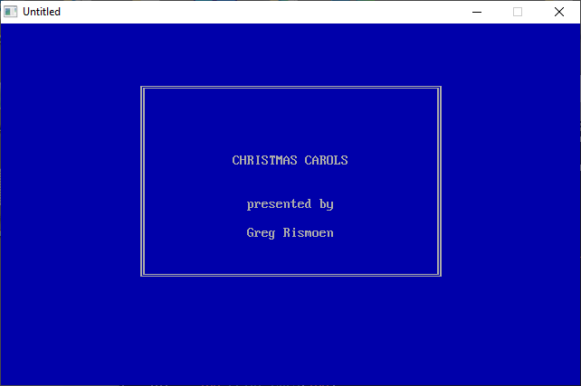

[Home](https://qb64.com) • [News](../../news.md) • [GitHub](https://github.com/QB64Official/qb64) • [Wiki](https://github.com/QB64Official/qb64/wiki) • [Samples](../../samples.md) • [InForm](../../inform.md) • [GX](../../gx.md) • [QBjs](../../qbjs.md) • [Community](../../community.md) • [More...](../../more.md)

## SAMPLE: CAROLS



### Author

[🐝 Greg Rismoen](../greg-rismoen.md) 

### Description

```text
10 REM *** CAROLS.BAS   A selection of Christmas Carols by Greg Rismoen 12/09/84
20 REM
30 REM Merry Christmas! This was programmed on my own time at home on an IBM-XT.
40 REM Donated to the public domain. All rights reserved. Not for commercial use.
```

### QBjs

> Please note that QBjs is still in early development and support for these examples is extremely experimental (meaning will most likely not work). With that out of the way, give it a try!

* [LOAD "carols.bas"](https://qbjs.org/index.html?src=https://qb64.com/samples/carols/src/carols.bas)
* [RUN "carols.bas"](https://qbjs.org/index.html?mode=auto&src=https://qb64.com/samples/carols/src/carols.bas)
* [PLAY "carols.bas"](https://qbjs.org/index.html?mode=play&src=https://qb64.com/samples/carols/src/carols.bas)

### File(s)

* [carols.bas](src/carols.bas)

🔗 [audio](../audio.md), [legacy](../legacy.md)
