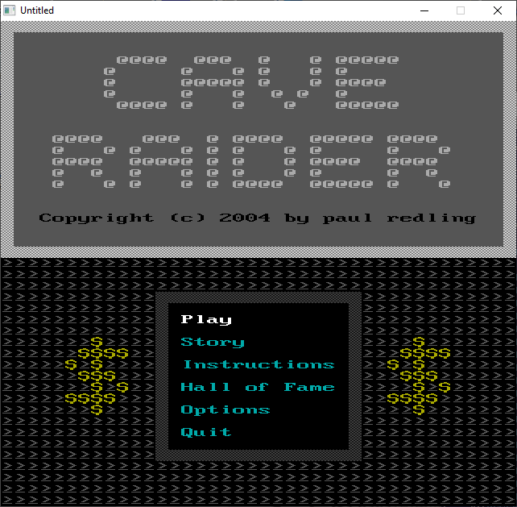

[Home](https://qb64.com) • [News](../../news.md) • [GitHub](https://github.com/QB64Official/qb64) • [Wiki](https://github.com/QB64Official/qb64/wiki) • [Samples](../../samples.md) • [InForm](../../inform.md) • [GX](../../gx.md) • [QBjs](../../qbjs.md) • [Community](../../community.md) • [More...](../../more.md)

## SAMPLE: CAVE RIDER



### Author

[🐝 Paul Redling](../paul-redling.md) 

### Description

```text
' ***************************************
' *                                     *
' * CAVE RAIDER             Version 1.4 *
' * ===========                         *
' * Copyright (c) 2004 by Paul  Redling *
' *                                     *
' ***************************************
```

### File(s)

* [cr-e.txt](src/cr-e.txt)
* [cr-g.txt](src/cr-g.txt)
* [cr.bas](src/cr.bas)
* [cr.zip](src/cr.zip)

🔗 [game](../game.md), [legacy](../legacy.md)
