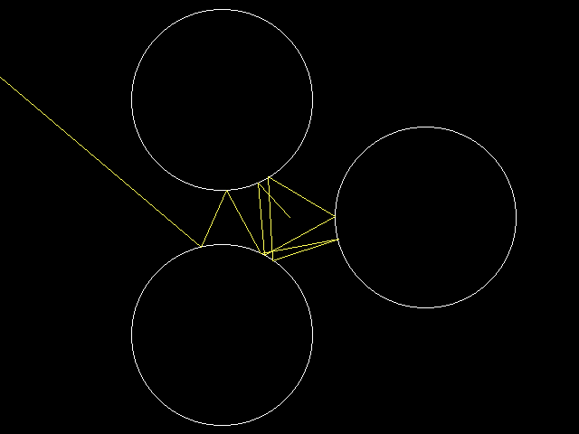

[Home](https://qb64.com) • [News](../../news.md) • [GitHub](https://github.com/QB64Official/qb64) • [Wiki](https://github.com/QB64Official/qb64/wiki) • [Samples](../../samples.md) • [InForm](../../inform.md) • [GX](../../gx.md) • [QBjs](../../qbjs.md) • [Community](../../community.md) • [More...](../../more.md)

## SAMPLE: CHAOTIC SCATTERING



### Author

[🐝 vince](../vince.md) 

### Description

```text
Demo of the Gaspard-Rice system. Left-click to change location.
```

### File(s)

* [chaoticscattering.bas](src/chaoticscattering.bas)
* [scatter2.bas](src/scatter2.bas)

🔗 [ray tracing](../ray-tracing.md), [reflections](../reflections.md), [qbjs](../qbjs.md)


<sub>Reference: [1](ttps://en.wikipedia.org/wiki/Chaotic_scattering) </sub>
