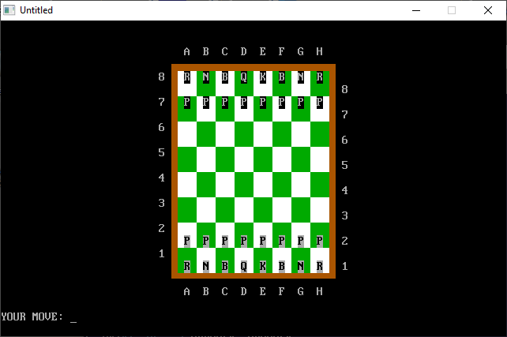

[Home](https://qb64.com) • [News](../../news.md) • [GitHub](https://github.com/QB64Official/qb64) • [Wiki](https://github.com/QB64Official/qb64/wiki) • [Samples](../../samples.md) • [InForm](../../inform.md) • [GX](../../gx.md) • [QBjs](../../qbjs.md) • [Community](../../community.md) • [More...](../../more.md)

## SAMPLE: CHESS QBASIC



### Author

[🐝 qbguy](../qbguy.md) 

### Description

```text
Chess, against a computer opponent with AI!

PRINT "QBASIC CHESS"
PRINT
PRINT "    CHESS is a game played between two players on a board of 64 squares."
PRINT " Chess was first invented in its current form in Europe during the late"
PRINT " fifteenth century.  It evolved from much earlier forms invented in India"
PRINT " and Persia."
PRINT "    The pieces are divided into Black and White.  Each player has 16 pieces:"
PRINT " 1 king, 1 queen, 2 rooks, 2 bishops, 2 knights, and 8 pawns.  White makes"
PRINT " the first move.  The players alternate moving one piece at a time.  Pieces"
PRINT " are moved to an unoccupied square, or moved onto a square occupied by an"
PRINT " opponent's piece, capturing it.  When the king is under attack, he is in"
PRINT " CHECK.  The player cannot put his king in check.  The object is to CHECKMATE"
PRINT " the opponent.  This occurs when the king is in check and there is no way to"
PRINT " remove the king from attack."
PRINT "   To move the pieces on the chessboard, type in your move in coordinate"
PRINT " notation, e.g. E2-E4 (not in English notation like P-K4).  To castle, type O-O"
PRINT " to castle kingside or O-O-O to castle queenside like in English notation."
PRINT " To exit the game, type QUIT."
```

### QBjs

> Please note that QBjs is still in early development and support for these examples is extremely experimental (meaning will most likely not work). With that out of the way, give it a try!

* [LOAD "chess.bas"](https://qbjs.org/index.html?src=https://qb64.com/samples/chess-qbasic/src/chess.bas)
* [RUN "chess.bas"](https://qbjs.org/index.html?mode=auto&src=https://qb64.com/samples/chess-qbasic/src/chess.bas)
* [PLAY "chess.bas"](https://qbjs.org/index.html?mode=play&src=https://qb64.com/samples/chess-qbasic/src/chess.bas)

### File(s)

* [chess.bas](src/chess.bas)

🔗 [game](../game.md), [chess](../chess.md), [legacy](../legacy.md)
