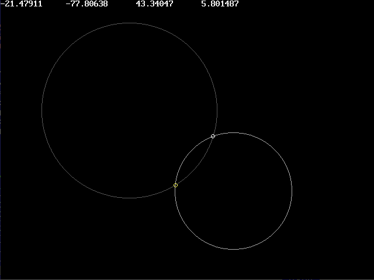

[Home](https://qb64.com) • [News](../../news.md) • [GitHub](https://github.com/QB64Official/qb64) • [Wiki](https://github.com/QB64Official/qb64/wiki) • [Samples](../../samples.md) • [InForm](../../inform.md) • [GX](../../gx.md) • [QBjs](../../qbjs.md) • [Community](../../community.md) • [More...](../../more.md)

## SAMPLE: CIRCLE INTERSECTING CIRCLE



### Authors

[🐝 bplus](../bplus.md) [🐝 STxAxTIC](../stxaxtic.md) 

### Description

```text
Here we present two (equivalent) methods for calculating the intersection points between any two circles.
```

### QBjs

> Please note that QBjs is still in early development and support for these examples is extremely experimental (meaning will most likely not work). With that out of the way, give it a try!

* [LOAD "circleintersectcircle.bas"](https://qbjs.org/index.html?src=https://qb64.com/samples/circle-intersecting-circle/src/circleintersectcircle.bas)
* [RUN "circleintersectcircle.bas"](https://qbjs.org/index.html?mode=auto&src=https://qb64.com/samples/circle-intersecting-circle/src/circleintersectcircle.bas)
* [PLAY "circleintersectcircle.bas"](https://qbjs.org/index.html?mode=play&src=https://qb64.com/samples/circle-intersecting-circle/src/circleintersectcircle.bas)

### File(s)

* [circleintersectcircle.bas](src/circleintersectcircle.bas)

🔗 [geometry](../geometry.md), [intersections](../intersections.md), [qbjs](../qbjs.md)


<sub>Reference: [qb64forum](https://qb64forum.alephc.xyz/index.php?topic=2299.0) </sub>
