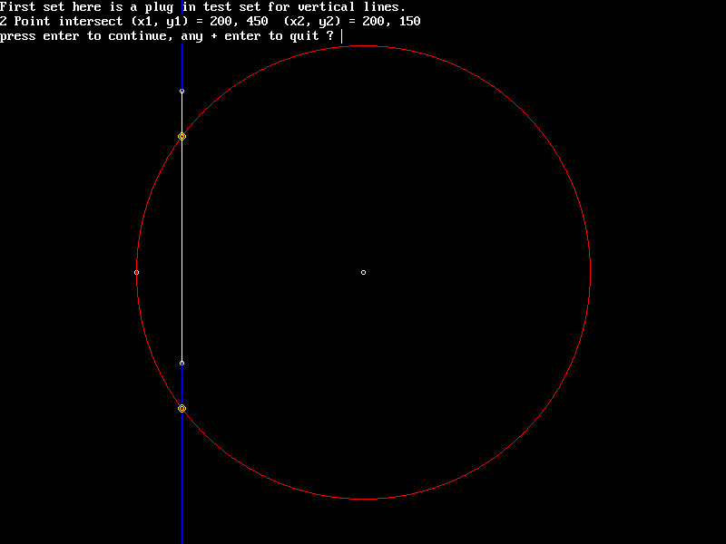

[Home](https://qb64.com) • [News](../../news.md) • [GitHub](https://github.com/QB64Official/qb64) • [Wiki](https://github.com/QB64Official/qb64/wiki) • [Samples](../../samples.md) • [InForm](../../inform.md) • [GX](../../gx.md) • [QBjs](../../qbjs.md) • [Community](../../community.md) • [More...](../../more.md)

## SAMPLE: CIRCLE INTERSECTING LINE



### Author

[🐝 bplus](../bplus.md) 

### Description

```text
This is an interactive (mouse-driven) demo that calculates the intersection of any line with any circle.
```

### QBjs

> Please note that QBjs is still in early development and support for these examples is extremely experimental (meaning will most likely not work). With that out of the way, give it a try!

* [LOAD "circle-intersect-line.bas"](https://qbjs.org/index.html?src=https://qb64.com/samples/circle-intersecting-line/src/circle-intersect-line.bas)
* [RUN "circle-intersect-line.bas"](https://qbjs.org/index.html?mode=auto&src=https://qb64.com/samples/circle-intersecting-line/src/circle-intersect-line.bas)
* [PLAY "circle-intersect-line.bas"](https://qbjs.org/index.html?mode=play&src=https://qb64.com/samples/circle-intersecting-line/src/circle-intersect-line.bas)

### File(s)

* [circle-intersect-line.bas](src/circle-intersect-line.bas)

🔗 [geometry](../geometry.md), [intersections](../intersections.md)


<sub>Reference: [qb64forum](https://qb64forum.alephc.xyz/index.php?topic=2301.0) </sub>
