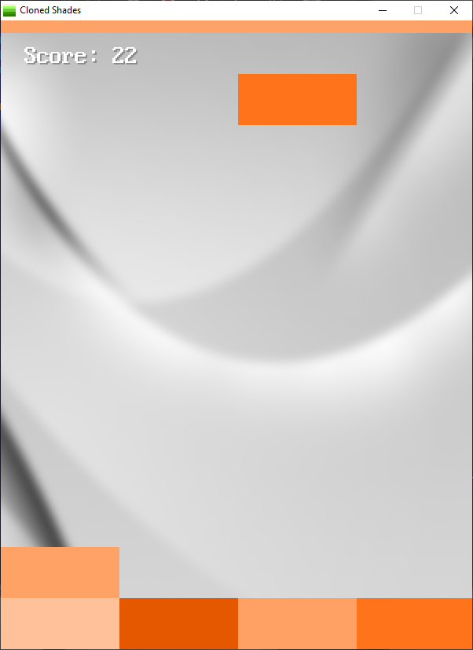

[Home](https://qb64.com) • [News](../../news.md) • [GitHub](../../github.md) • [Wiki](../../wiki.md) • [Samples](../../samples.md) • [Media](../../media.md) • [Community](../../community.md) • [Rolodex](../../rolodex.md) • [More...](../../more.md)

## SAMPLE: CLONED SHADES



### Author

[🐝 Fellippe Heitor](../fellippe-heitor.md) 

### Description

```text
A clone of 'Shades' which was originally developed by UOVO.
```

### File(s)

* [shades.bas](src/shades.bas)
* [shades.zip](src/shades.zip)

🔗 [game](../game.md)


<sub>Reference: [github.com](https://github.com/FellippeHeitor/Cloned-Shades) </sub>
