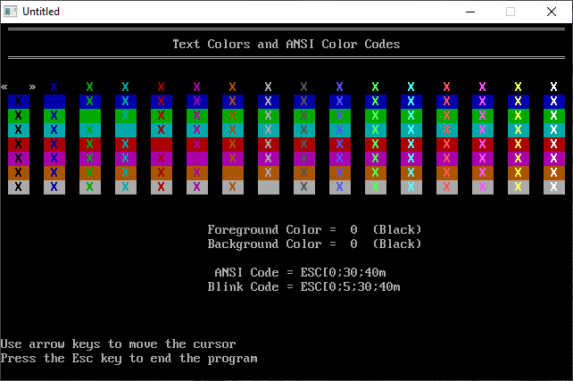

[Home](https://qb64.com) • [News](../../news.md) • [GitHub](https://github.com/QB64Official/qb64) • [Wiki](https://github.com/QB64Official/qb64/wiki) • [Samples](../../samples.md) • [InForm](../../inform.md) • [GX](../../gx.md) • [QBjs](../../qbjs.md) • [Community](../../community.md) • [More...](../../more.md)

## SAMPLE: COLORS



### Author

[🐝 Hardin Brothers](../hardin-brothers.md) 

### Description

```text
'   COLORS.BAS
'   Copyright (c) 1993 DOS Resource Guide
'   Published in Issue #12, November 1993, page 69.

' This program lets you pick foreground
' and background text colors by moving
' a cursor with the arrow keys.
' The program displays the QBasic color numbers,
' the color names, and the ANSI codes that
' will generate those colors.
' You should find this program handy if you are
' customizing your DOS prompt, designing a batch
' file menu screen, or writing a QBasic program.

' Written by Hardin Brothers

==============================================================================

------------
 COLORS.BAS
------------
SYSTEM REQUIREMENTS:
The version of QBasic that comes with DOS 5 or later, or Microsoft Quick Basic 
4.x.

WHAT COLORS.BAS DOES:
This color-finder program displays the various screen color combinations 
available for your use in batch files and prompt commands.  Using COLORS.BAS, 
you can select the color schemes you prefer and the program will provide the 
data you need to create ANSI escape sequences for your use.  The program also 
provides the color numbers used in QBasic and other programs to specify screen 
colors.

USING COLORS.BAS:
To load the program, type QBASIC COLORS.BAS (using path names if necessary) at 
the DOS prompt. Then run the program by selecting the Start option in QBasic's 
Run menu, or press Shift-F5. The screen will show you the 128 color 
combinations available to you for use in batch files, PROMPT commands, and 
QBasic programs.  These combinations are made up of 16 foreground colors, 
used mainly for text, and 8 background colors.

Use the cursor keys to move from one color combination to another.  As you do, 
a window in the lower left corner of the display will show you some sample 
text using the currently-selected foreground and background colors.  To the 
right of the window, you'll see four lines of information.  The first two 
lines tell you the numbers and names of the selected foreground and background 
colors.  The third and fourth lines display ANSI escape sequences: The former 
shows the sequence necessary to create the selected color combination; the 
latter shows the sequence for the same colors, but with blinking text.

You can use these ANSI sequences in batch files in two ways. First, you can 
add them to the PROMPT command, replacing the leading ESC with $E to change 
your screen colors at the DOS prompt temporarily or permanently.

For example, let's say you'd like to change your colors to light green text on 
a blue screen. You load COLORS.BAS and move the cursor to the right color 
combination. COLORS.BAS tells you that the required escape sequence is 
ESC[0;32;44;1m. You then type this command at the DOS PROMPT:

PROMPT $e[0;32;44;1m$p$g

The $p$g options give you the familiar C:\> prompt. To make the colors 
permanent, you would include this line in your AUTOEXEC.BAT file.

Second, you can use the escape sequences with the ECHO command to set the 
colors for all or part of a batch-file display. When you use the ECHO command, 
you must replace the letters ESC with the Escape character, which is the ASCII 
code 27. The editor that you use to write batch files probably has a way to 
add this special character to the text that it creates. If you use the EDIT 
program included with DOS 5.0, 6.0, and 6.2, press Ctrl-P and then the ESC key 
to create the Escape character, which will look like a small left-pointing 
arrow on your screen.

For example, imagine that you want to write a small batch file that tells the 
user what letter he or she should press to load one of three programs. Each 
line will look something like this:

Press F to load FoxPro

To get the user's attention, you want the colors to be black text on a gray 
background, with the letters in blinking red. You run COLORS.BAS. It tells you 
that the escape sequence for black on gray is ESC[0;30;47;1m, and the sequence 
for blinking red on gray is ESC[5;31;47;1m. Your batch file, then, might look 
like this:

@ECHO off
CLS
ECHO ESC[2J
ECHO ESC[0;30;47;1mPress ESC[5;31;47;1mF ESC[0;30;47;1mto run FoxProESC[K
ECHO ESC[0;30;47;1mPress ESC[5;31;47;1mQ ESC[0;30;47;1mto run QuattroESC[K
ECHO ESC[0;30;47;1mPress ESC[5;31;47;1mW ESC[0;30;47;1mto run WordPerfectESC[K
ECHO ESC[0;37;40;1m
ECHO.
ECHO.

Again, remember to substitute the Escape character wherever you see "ESC" in 
the batch file listing above.

No matter how you use the ANSI commands, make sure that you copy the rest of 
the line exactly, including the square brackets, and note that some characters 
must be lowercase. Also, remember that the lines won't do anything unless you 
have ANSI.SYS installed with your CONFIG.SYS file.  Assuming that the ANSI.SYS 
file is in your C:\DOS directory, the following line must be in CONFIG.SYS:

DEVICE=C:\DOS\ANSI.SYS

For further details on COLORS.BAS, see "Color Me QBasic" (DRG #12, November 
1993, page 69).
```

### QBjs

> Please note that QBjs is still in early development and support for these examples is extremely experimental (meaning will most likely not work). With that out of the way, give it a try!

* [LOAD "colors.bas"](https://qbjs.org/index.html?src=https://qb64.com/samples/colors/src/colors.bas)
* [RUN "colors.bas"](https://qbjs.org/index.html?mode=auto&src=https://qb64.com/samples/colors/src/colors.bas)
* [PLAY "colors.bas"](https://qbjs.org/index.html?mode=play&src=https://qb64.com/samples/colors/src/colors.bas)

### File(s)

* [colors.bas](src/colors.bas)

🔗 [color picker](../color-picker.md), [dos world](../dos-world.md)
