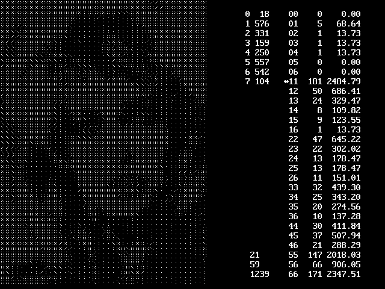

[Home](https://qb64.com) • [News](../../news.md) • [GitHub](https://github.com/QB64Official/qb64) • [Wiki](https://github.com/QB64Official/qb64/wiki) • [Samples](../../samples.md) • [InForm](../../inform.md) • [GX](../../gx.md) • [QBjs](../../qbjs.md) • [Community](../../community.md) • [More...](../../more.md)

## SAMPLE: CONVERT BMP TO DOMINOES



### Author

[🐝 Richard Frost](../richard-frost.md) 

### Description

```text
[This] is an image converter that takes a picture a small block at a time and finds the "best fit" domino for that space. (The woman is Heather Thomas.)
```

### File(s)

* [bmp2dominoes.bas](src/bmp2dominoes.bas)
* [convert-bmp-to-dominoes.zip](src/convert-bmp-to-dominoes.zip)
* [heath.bmp](src/heath.bmp)

🔗 [image processing](../image-processing.md)


<sub>Reference: [qb64forum](https://qb64forum.alephc.xyz/index.php?topic=4211.0) </sub>
