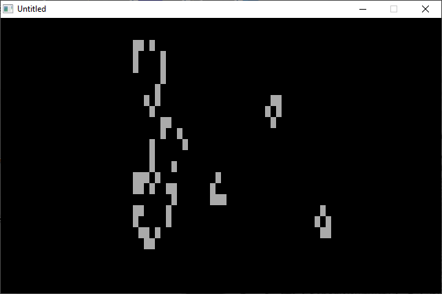

[Home](https://qb64.com) • [News](../../news.md) • [GitHub](https://github.com/QB64Official/qb64) • [Wiki](https://github.com/QB64Official/qb64/wiki) • [Samples](../../samples.md) • [InForm](../../inform.md) • [GX](../../gx.md) • [QBjs](../../qbjs.md) • [Community](../../community.md) • [More...](../../more.md)

## SAMPLE: CONWAYS GAME OF LIFE



### Author

[🐝 Luke](../luke.md) 

### Description

```text
Standard Conway's Game of Life simulation.
```

### QBjs

> Please note that QBjs is still in early development and support for these examples is extremely experimental (meaning will most likely not work). With that out of the way, give it a try!

* [LOAD "cgol.bas"](https://qbjs.org/index.html?src=https://qb64.com/samples/conways-game-of-life/src/cgol.bas)
* [RUN "cgol.bas"](https://qbjs.org/index.html?mode=auto&src=https://qb64.com/samples/conways-game-of-life/src/cgol.bas)
* [PLAY "cgol.bas"](https://qbjs.org/index.html?mode=play&src=https://qb64.com/samples/conways-game-of-life/src/cgol.bas)

### File(s)

* [cgol.bas](src/cgol.bas)

🔗 [automata](../automata.md), [conway](../conway.md)
