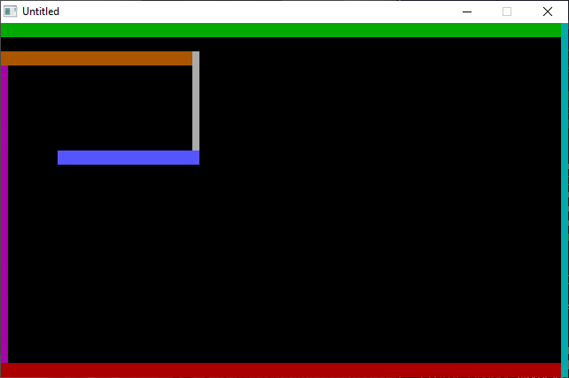

[Home](https://qb64.com) • [News](../../news.md) • [GitHub](https://github.com/QB64Official/qb64) • [Wiki](https://github.com/QB64Official/qb64/wiki) • [Samples](../../samples.md) • [InForm](../../inform.md) • [GX](../../gx.md) • [QBjs](../../qbjs.md) • [Community](../../community.md) • [More...](../../more.md)

## SAMPLE: CRAM



### Author

[🐝 Hardin Brothers](../hardin-brothers.md) 

### Description

```text
'CRAM!
'   by Hardin Brothers
'
'   Copyright (C) 1993 DOS Resource Guide
'   Published in Issue #9, May 1993, page 57
'
'This program may be run in DOS 5.0's QBasic or
'compiled with QuickBasic 4.0 or later, or with
'Visual Basic for DOS.
'

==============================================================================

----------
 CRAM.BAS
----------
SYSTEM REQUIREMENTS:
The version of QBasic that comes with DOS 5 or later, Quick Basic 4.x, or 
Microsoft Visual Basic for DOS.

WHAT CRAM.BAS DOES:
This simple but addictive game challenges you to maneuver an ever-growing worm 
inside an ever-shrinking box. Increasing the difficulty level speeds the rate 
at which the worm grows.

USING CRAM.BAS:
To load the program in QBasic, type QBASIC CRAM.BAS (using path names if 
necessary) at the DOS prompt. Then run the program by selecting the Start 
option in QBasic's Run menu, or press Shift-F5.

The opening screen displays the game's simple instructions and asks you choose 
a difficulty level. If you need to warm up your reflexes, start with the easy 
level, level 3, and then work your way up to level 2 and level 1. After you 
choose a playing level, the game starts right in. The object is to press any 
key to make your worm change direction just before hitting a wall. The more 
turns you can make, the higher you will score. Play ends when your worm hits a 
wall.

As written, Cram displays your score (the number of turns you make) at the end 
of each game and automatically starts another game. Pressing Esc at any time 
brings up a "Press any key to continue" message. Press Esc again to exit the 
program and return to the QBasic screen.

For further details on CRAM.BAS, see "Cram!" (DRG #9, May 1993, page 57).
```

### QBjs

> Please note that QBjs is still in early development and support for these examples is extremely experimental (meaning will most likely not work). With that out of the way, give it a try!

* [LOAD "cram.bas"](https://qbjs.org/index.html?src=https://qb64.com/samples/cram/src/cram.bas)
* [RUN "cram.bas"](https://qbjs.org/index.html?mode=auto&src=https://qb64.com/samples/cram/src/cram.bas)
* [PLAY "cram.bas"](https://qbjs.org/index.html?mode=play&src=https://qb64.com/samples/cram/src/cram.bas)

### File(s)

* [cram.bas](src/cram.bas)

🔗 [game](../game.md), [dos world](../dos-world.md)
