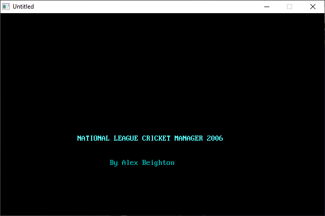

[Home](https://qb64.com) • [News](../../news.md) • [GitHub](https://github.com/QB64Official/qb64) • [Wiki](https://github.com/QB64Official/qb64/wiki) • [Samples](../../samples.md) • [InForm](../../inform.md) • [GX](../../gx.md) • [QBjs](../../qbjs.md) • [Community](../../community.md) • [More...](../../more.md)

## SAMPLE: CRICKET MANAGER



### Author

[🐝 Alex Beighton](../alex-beighton.md) 

### Description

```text
NATIONAL LEAGUE CRICKET MANAGER 2006 - an entertaining cricket manager game based on England's domestic National League competition. Deal with a whole host of managerial aspects, both on and off pitch, as you attempt to bring success to your county! The game, which was created in QBasic, features all 19 National League teams and a total of 342 domestic players, each with personalised player attributes and ratings.
```

### QBjs

> Please note that QBjs is still in early development and support for these examples is extremely experimental (meaning will most likely not work). With that out of the way, give it a try!

* [LOAD "nlcm.bas"](https://qbjs.org/index.html?src=https://qb64.com/samples/cricket-manager/src/nlcm.bas)
* [RUN "nlcm.bas"](https://qbjs.org/index.html?mode=auto&src=https://qb64.com/samples/cricket-manager/src/nlcm.bas)
* [PLAY "nlcm.bas"](https://qbjs.org/index.html?mode=play&src=https://qb64.com/samples/cricket-manager/src/nlcm.bas)

### File(s)

* [nlcm.bas](src/nlcm.bas)
* [nlcm.zip](src/nlcm.zip)

🔗 [game](../game.md), [cricket](../cricket.md), [legacy](../legacy.md)
