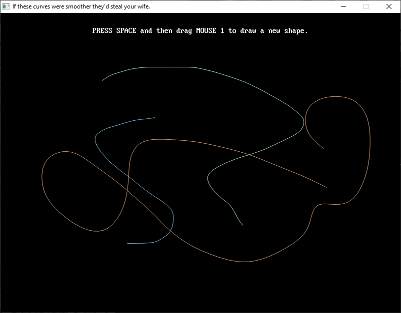

[Home](https://qb64.com) • [News](../../news.md) • [GitHub](https://github.com/QB64Official/qb64) • [Wiki](https://github.com/QB64Official/qb64/wiki) • [Samples](../../samples.md) • [InForm](../../inform.md) • [GX](../../gx.md) • [QBjs](../../qbjs.md) • [Community](../../community.md) • [More...](../../more.md)

## SAMPLE: CURVE SMOOTHER



### Authors

[🐝 STxAxTIC](../stxaxtic.md) [🐝 Fellippe Heitor](../fellippe-heitor.md) 

### Description

```text
This program demonstrates (i) linear interpolation to create a curve between points, (ii) a relaxation algorithm to "smooth over" a curve to remove sharp edges, and (iii) plotting with anti-aliasing.
```

### QBjs

> Please note that QBjs is still in early development and support for these examples is extremely experimental (meaning will most likely not work). With that out of the way, give it a try!

* [LOAD "curve-smoother.bas"](https://qbjs.org/index.html?src=https://qb64.com/samples/curve-smoother/src/curve-smoother.bas)
* [RUN "curve-smoother.bas"](https://qbjs.org/index.html?mode=auto&src=https://qb64.com/samples/curve-smoother/src/curve-smoother.bas)
* [PLAY "curve-smoother.bas"](https://qbjs.org/index.html?mode=play&src=https://qb64.com/samples/curve-smoother/src/curve-smoother.bas)

### File(s)

* [curve-smoother.bas](src/curve-smoother.bas)

🔗 [curve](../curve.md), [interpolation](../interpolation.md)


<sub>Reference: [qb64forum](https://qb64forum.alephc.xyz/index.php?topic=184.0) </sub>
