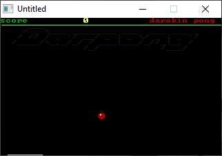

[Home](https://qb64.com) • [News](../../news.md) • [GitHub](https://github.com/QB64Official/qb64) • [Wiki](https://github.com/QB64Official/qb64/wiki) • [Samples](../../samples.md) • [InForm](../../inform.md) • [GX](../../gx.md) • [QBjs](../../qbjs.md) • [Community](../../community.md) • [More...](../../more.md)

## SAMPLE: DARPONG



### Author

[🐝 darokin](../darokin.md) 

### Description

```text
Darpong
	author: darokin   -  Adrien Rebuzzi
   e-mail : darokin@infonie.fr

Darpong is a simple 1 player pong game with the score and speed increasing
each time you save the ball.
suggest or request etc..: darokin@infonie.fr
Thanks to future software to rank prog in qbasic.

'little game I made, just for fun
'and also to be rated on future software
'I hope you'll learn something with this little prog
'author  : darokin         Adrien Rebuzzi
'any comment or suggest here : darokin@infonie.fr
'darokin '99
```

### File(s)

* [darpong.bas](src/darpong.bas)
* [darpong.exe](src/darpong.exe)

🔗 [game](../game.md), [pong](../pong.md), [legacy](../legacy.md)
