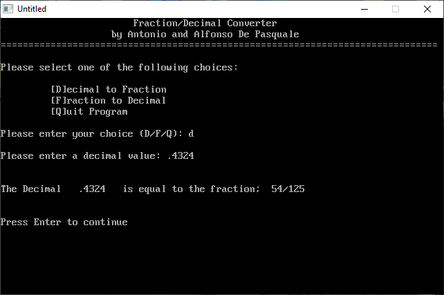

[Home](https://qb64.com) • [News](../../news.md) • [GitHub](https://github.com/QB64Official/qb64) • [Wiki](https://github.com/QB64Official/qb64/wiki) • [Samples](../../samples.md) • [InForm](../../inform.md) • [GX](../../gx.md) • [QBjs](../../qbjs.md) • [Community](../../community.md) • [More...](../../more.md)

## SAMPLE: DEC TO FRAC



### Author

[🐝 A&A De Pasquale](../a&a-de-pasquale.md) 

### Description

```text
'  DEC_FRAC.BAS - Fraction/Decimal conversion functions
'                and sample program

'  by Antonio and Alfonso De Pasquale
'  Copyright (C) 1993 DOS Resource Guide
'  Published in Issue #10, July 1993, page 46

==============================================================================

--------------
 DEC_FRAC.BAS
--------------
SYSTEM REQUIREMENTS:
The version of QBasic that comes with DOS 5 or later, or Microsoft Quick Basic 
4.x.

WHAT DEC_FRAC.BAS DOES:
This program converts decimals to fractions and fractions to decimals.

USING DEC_FRAC.BAS:
To load the program in QBasic, type QBASIC DEC_FRAC.BAS (using path names if 
necessary) at the DOS prompt. Then run the program by selecting the Start 
option in QBasic's Run menu, or press Shift-F5. The screen will clear, then a 
menu will ask if you want to convert a decimal to a fraction or a fraction to 
a decimal.

If you select decimal to fraction, you'll then be prompted to enter a number.  
Entering .4, for instance, yields the fractional conversion, 2/5.  Entering 
.125 produces the fractional equivalent, 1/8.

For fraction to decimal conversions, you enter fractions using the slash.  For 
example, entering 3/7 gives a decimal answer of .4285714

For further details on DEC_FRAC.BAS, see "Fraction Maker" (DRG #10, July 1993, 
page 45).
```

### QBjs

> Please note that QBjs is still in early development and support for these examples is extremely experimental (meaning will most likely not work). With that out of the way, give it a try!

* [LOAD "dec_frac.bas"](https://qbjs.org/index.html?src=https://qb64.com/samples/dec-to-frac/src/dec_frac.bas)
* [RUN "dec_frac.bas"](https://qbjs.org/index.html?mode=auto&src=https://qb64.com/samples/dec-to-frac/src/dec_frac.bas)
* [PLAY "dec_frac.bas"](https://qbjs.org/index.html?mode=play&src=https://qb64.com/samples/dec-to-frac/src/dec_frac.bas)

### File(s)

* [dec_frac.bas](src/dec_frac.bas)

🔗 [math](../math.md), [dos world](../dos-world.md), [qbjs](../qbjs.md)
