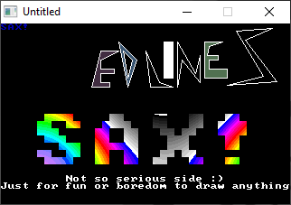

[Home](https://qb64.com) • [News](../../news.md) • [GitHub](https://github.com/QB64Official/qb64) • [Wiki](https://github.com/QB64Official/qb64/wiki) • [Samples](../../samples.md) • [InForm](../../inform.md) • [GX](../../gx.md) • [QBjs](../../qbjs.md) • [Community](../../community.md) • [More...](../../more.md)

## SAMPLE: DEEDLINES SAX



### Author

[🐝 Michael Kargas](../michael-kargas.md) 

### Description

```text
Deedlines Sax...

A pure Qbasic demo done by connecting various older or newer sources..

Featuring effects like blobs, sphere mapping, 3d dots, raycaster and more..

Coded by Michael Kargas aka Optimus/Dirty Minds/Nasty Bugs

                  Thessaloniki 31/05/2002

P.S. I had finished this demo for the competition in a hurry, cause I am busy
with other lame things after that (Exams, e.t.c..) Hopefully, I may fix
possible bad things in this demo in a final version found somewhere around my
site (http://users.auth.gr/mkargas)

Time to rest... cu later!
```

### QBjs

> Please note that QBjs is still in early development and support for these examples is extremely experimental (meaning will most likely not work). With that out of the way, give it a try!

* [LOAD "deedsaks.bas"](https://qbjs.org/index.html?src=https://qb64.com/samples/deedlines-sax/src/deedsaks.bas)
* [RUN "deedsaks.bas"](https://qbjs.org/index.html?mode=auto&src=https://qb64.com/samples/deedlines-sax/src/deedsaks.bas)
* [PLAY "deedsaks.bas"](https://qbjs.org/index.html?mode=play&src=https://qb64.com/samples/deedlines-sax/src/deedsaks.bas)

### File(s)

* [deedsaks.bas](src/deedsaks.bas)
* [deedsaks.zip](src/deedsaks.zip)

🔗 [graphics](../graphics.md), [legacy](../legacy.md)
