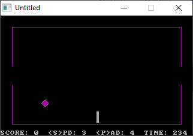

[Home](https://qb64.com) • [News](../../news.md) • [GitHub](https://github.com/QB64Official/qb64) • [Wiki](https://github.com/QB64Official/qb64/wiki) • [Samples](../../samples.md) • [InForm](../../inform.md) • [GX](../../gx.md) • [QBjs](../../qbjs.md) • [Community](../../community.md) • [More...](../../more.md)

## SAMPLE: DIAMOND PONG



### Author

[🐝 John Wolfskill](../john-wolfskill.md) 

### Description

```text
'                      Diamond Pong
'                           by
'                     John Wolfskill
'
'  Copyright (C) 1993 DOS Resource Guide
'  Published in Issue #9, May 1993
'
'  Requires IBM PC with CGA, EGA or VGA color monitor
'  A joystick is optional (recommended)

==============================================================================

-----------
 DPONG.BAS
-----------
SYSTEM REQUIREMENTS:
The version of QBasic that comes with DOS 5 or later, or Microsoft Quick Basic 
4.x. A joystick is optional.

WHAT DPONG.BAS DOES:
The object of this spin-off of the perennial favorite, Pong, is to score as 
many points as possible while propelling a bouncing diamond-shaped pong 
through goals located at opposite ends of the playing field.

USING DPONG.BAS:
To load the program in QBasic, type QBASIC DPONG.BAS (using path names if 
necessary) at the DOS prompt. Then run the program by selecting the Start 
option in QBasic's Run menu, or press Shift-F5. When the program starts, you 
are prompted for the type of monitor you use. Press the 1 key for VGA or the 2 
key for CGA or EGA. Next, select the appropriate input device, pressing 1 for 
the keyboard and 2 for the joystick.

When the diamond-shaped pong appears, you have two minutes to rack up points. 
Although the games starts out easy, it becomes more difficult as your score 
increases: Walls, bumpers, and other impediments spring up to make play more 
challenging. Each time you score a point, you are rewarded with 15 seconds of 
extra playing time.

To control the speed of your paddle, press the P key to decrease the speed and 
Shift-P to increase it. The S key and Shift-S control the speed of the pong in 
similar fashion. If yours is a relatively slow PC (or you're using the 
keyboard for input), you may need to adjust the paddle and pong speeds until 
the game feels comfortable.

For further details on DPONG.BAS, see "Diamond Pong" (DRG #9, May 1993, page 
53) and "A Games the Thing" (DRG #9, May 1993, page 59).
```

### QBjs

> Please note that QBjs is still in early development and support for these examples is extremely experimental (meaning will most likely not work). With that out of the way, give it a try!

* [LOAD "dpong.bas"](https://qbjs.org/index.html?src=https://qb64.com/samples/diamond-pong/src/dpong.bas)
* [RUN "dpong.bas"](https://qbjs.org/index.html?mode=auto&src=https://qb64.com/samples/diamond-pong/src/dpong.bas)
* [PLAY "dpong.bas"](https://qbjs.org/index.html?mode=play&src=https://qb64.com/samples/diamond-pong/src/dpong.bas)

### File(s)

* [dpong.bas](src/dpong.bas)

🔗 [game](../game.md), [pong](../pong.md), [dos world](../dos-world.md)
