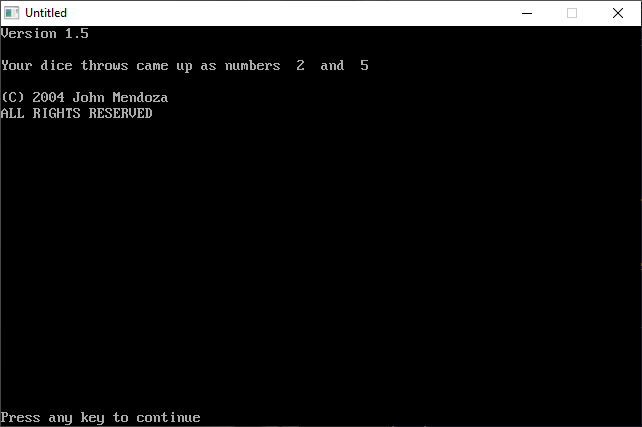

[Home](https://qb64.com) • [News](../../news.md) • [GitHub](https://github.com/QB64Official/qb64) • [Wiki](https://github.com/QB64Official/qb64/wiki) • [Samples](../../samples.md) • [InForm](../../inform.md) • [GX](../../gx.md) • [QBjs](../../qbjs.md) • [Community](../../community.md) • [More...](../../more.md)

## SAMPLE: DICEIT



### Author

[🐝 John Mendoza](../john-mendoza.md) 

### Description

```text
'This is a very simple dice game. I am still new at Qb so please humor me.
'Also, Thank You for downloading this!

REM Created 8/27/04
```

### QBjs

> Please note that QBjs is still in early development and support for these examples is extremely experimental (meaning will most likely not work). With that out of the way, give it a try!

* [LOAD "diceit.bas"](https://qbjs.org/index.html?src=https://qb64.com/samples/diceit/src/diceit.bas)
* [RUN "diceit.bas"](https://qbjs.org/index.html?mode=auto&src=https://qb64.com/samples/diceit/src/diceit.bas)
* [PLAY "diceit.bas"](https://qbjs.org/index.html?mode=play&src=https://qb64.com/samples/diceit/src/diceit.bas)

### File(s)

* [diceit.bas](src/diceit.bas)

🔗 [game](../game.md), [dice](../dice.md), [legacy](../legacy.md), [qbjs](../qbjs.md)
