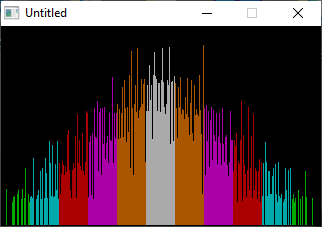

[Home](https://qb64.com) • [News](../../news.md) • [GitHub](https://github.com/QB64Official/qb64) • [Wiki](https://github.com/QB64Official/qb64/wiki) • [Samples](../../samples.md) • [InForm](../../inform.md) • [GX](../../gx.md) • [QBjs](../../qbjs.md) • [Community](../../community.md) • [More...](../../more.md)

## SAMPLE: DIE ODDS



### Author

[🐝 Tom Sales](../tom-sales.md) 

### Description

```text
Copyright (C) 1994-95 DOS Resource Guide/DOS World 
Published in Issue #17, September 1994, page 66 and 
              Issue #20, March 1995, page 64 
 
It takes clever programming indeed to create an 
interesting one-line program. You'll be amazed at 
how much can be accomplished. 

DIE_ODDS.BAS simulates the results of tossing two dice, dropping "rocks" in  
ever-growing piles to illustrate the outcome visually. If you toss two dice,  
the odds are greatest that you'll throw a total of seven; a sum of 2 or 12 is  
the least likely to turn up. In the program's on-screen display, the left  
column indicates the number of times the value of a roll will equal 2, the  
next column shows the number of times it will equal 3, and so on. Piles of  
equal color represent totals with the same odds.
```

### QBjs

> Please note that QBjs is still in early development and support for these examples is extremely experimental (meaning will most likely not work). With that out of the way, give it a try!

* [LOAD "die_odds.bas"](https://qbjs.org/index.html?src=https://qb64.com/samples/die-odds/src/die_odds.bas)
* [RUN "die_odds.bas"](https://qbjs.org/index.html?mode=auto&src=https://qb64.com/samples/die-odds/src/die_odds.bas)
* [PLAY "die_odds.bas"](https://qbjs.org/index.html?mode=play&src=https://qb64.com/samples/die-odds/src/die_odds.bas)

### File(s)

* [die_odds.bas](src/die_odds.bas)

🔗 [statistics](../statistics.md), [dos world](../dos-world.md), [254 chars](../254-chars.md)
