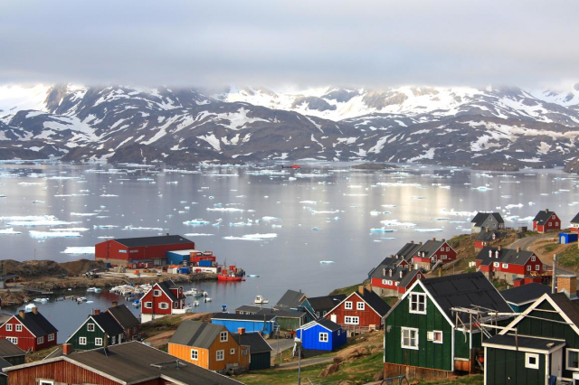
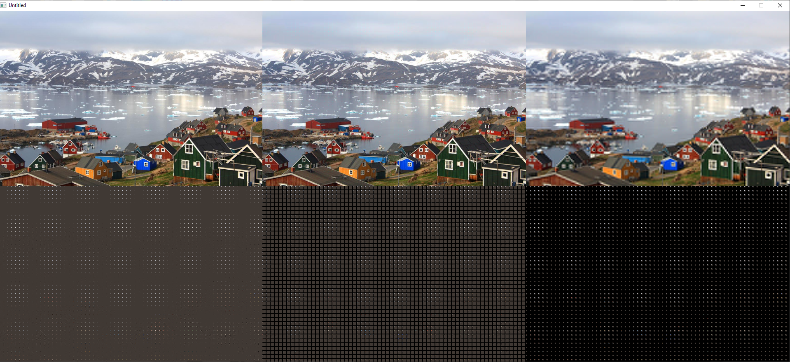

[Home](https://qb64.com) • [News](../../news.md) • [GitHub](https://github.com/QB64Official/qb64) • [Wiki](https://github.com/QB64Official/qb64/wiki) • [Samples](../../samples.md) • [InForm](../../inform.md) • [GX](../../gx.md) • [QBjs](../../qbjs.md) • [Community](../../community.md) • [More...](../../more.md)

## SAMPLE: DISCRETE COSINE TRANSFORM



### Author

[🐝 Vince](../vince.md) 

### Description

```text
Demonstrates how jpegs are made. Not for the faint of mind.
```

### File(s)

* [dct1.bas](src/dct1.bas)
* [dct1.zip](src/dct1.zip)
* [greenland1.png](src/greenland1.png)

### Additional Image(s)



🔗 [image processing](../image-processing.md), [compression](../compression.md), [jpeg](../jpeg.md)
