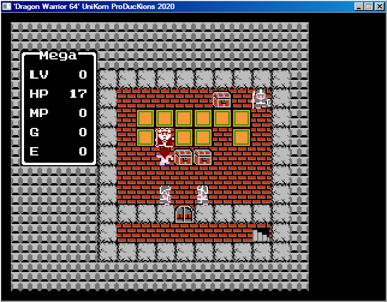
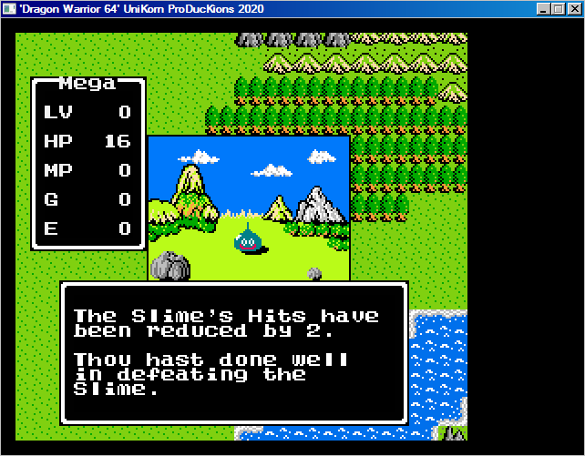
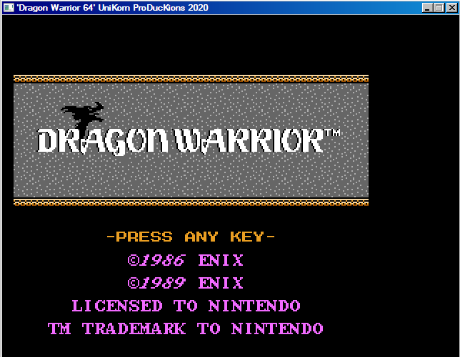

[Home](https://qb64.com) • [News](../../news.md) • [GitHub](https://github.com/QB64Official/qb64) • [Wiki](https://github.com/QB64Official/qb64/wiki) • [Samples](../../samples.md) • [InForm](../../inform.md) • [GX](../../gx.md) • [QBjs](../../qbjs.md) • [Community](../../community.md) • [More...](../../more.md)

## SAMPLE: DRAGON WARRIOR



### Author

[🐝 Cobalt](../cobalt.md) 

### Description

```text
QB64 version of Nintendo Dragon Quest (Dragon Warrior).  The time has come to go on your quest to find and defeat the evil DragonLord.  I hope that you have fun playing this game.

DEFAULT Controls:
It does have a better feel when playing with a Joypad but it is not required.
Start button = A (upper case)
A Button = Space bar (accept selection)
B Button = Enter (cancel action\ selection)
Arrow keys for movement
```

### File(s)

* [dragon-warrior-2021-08-26.zip](src/dragon-warrior-2021-08-26.zip)

### Additional Image(s)




🔗 [game](../game.md), [rpg](../rpg.md)


<sub>Reference: [qb64forum](https://qb64forum.alephc.xyz/index.php?topic=2695.0) </sub>
